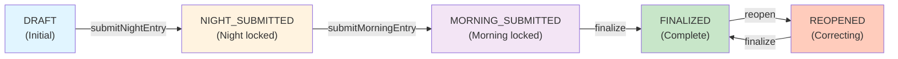
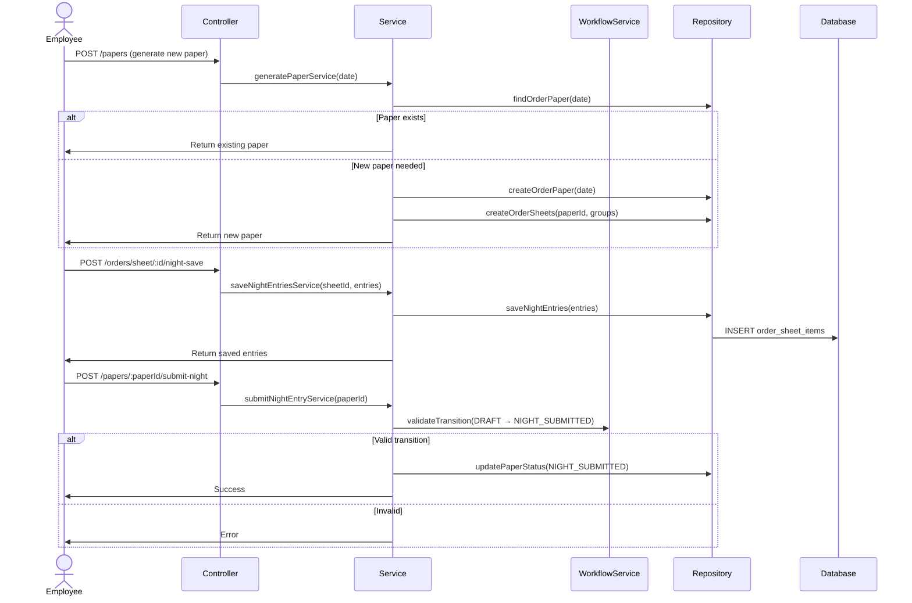

# Architecture & System Design

## Overview

The Milk Distribution Server follows a **layered, modular architecture** with clear separation of concerns. The system implements a **state machine-based workflow** for daily paper management with role-based access control.

---

## Architectural Layers

### 1. Controller Layer (HTTP Entry Point)
- Handles incoming HTTP requests
- Validates role-based access with `@Roles()` decorator and `RolesGuard`
- Deserializes and validates request DTOs
- Returns JSON responses

**Location**: `src/modules/*/module.controller.ts`

**Example**:
```typescript
@Controller('papers')
@UseGuards(JwtAuthGuard, RolesGuard)
export class PaperController {
  constructor(private readonly paperService: PaperService) {}

  @Post(':paperId/finalize')
  @Roles('ADMIN')
  async finalizePaper(@Param('paperId', ParseIntPipe) paperId: number) {
    return this.paperService.finalizePaperService(paperId);
  }
}
```

### 2. Service Layer (Business Logic)
- Encapsulates business rules and workflows
- Calls repository for data access
- Performs validation and state transitions
- Coordinates across modules

**Location**: `src/modules/*/module.service.ts`

**Responsibilities**:
- Order entry processing (night/morning)
- Paper workflow state transitions
- Collection tracking and calculations
- Vehicle allocation and purchase validation
- Billing group delivery reconciliation
- Delivery summary generation
- Cash settlement reconciliation
- Route expense tracking
- Office bank deposit management

### 3. Repository Layer (Data Access)
- Abstracts database queries from service
- Encapsulates Prisma client calls
- Implements query logic and data transformations

**Location**: `src/modules/*/module.repository.ts`

**Example Pattern**:
```typescript
async saveNightEntries(sheetId: number, entries: SaveNightEntriesDto[]) {
  return await this.prisma.order_sheet_items.createMany({
    data: entries.map(entry => ({
      order_sheet_id: sheetId,
      client_id: entry.clientId,
      product_id: entry.productId,
      ordered_qty: entry.orderedQty,
    })),
  });
}
```

### 4. Database Layer (Prisma ORM)
- PostgreSQL database managed through Prisma ORM with domain models covering orders, collections, trays, vehicles, purchases,cash settlement and bank reconciliation, authentication, and workflow management.
- Prisma schema defines entities and relationships
- Auto-generated Prisma client in `src/generated/prisma/`
- Migrations track schema evolution

**Location**: `src/prisma/schema.prisma`

### 5. Cross-Cutting Concerns
- **Authentication**: JWT tokens via `JwtAuthGuard`
- **Authorization**: Role-based decorators via `RolesGuard`
- **Validation**: DTO validators using `class-validator`
- **Error Handling**: HTTP exception filters
- **Transformation**: DTO transformers using `class-transformer`

---

## Module Organization

### Modular Structure
Each feature module is self-contained with clear dependencies:

```
Module Structure:
├── Controller              → Handles HTTP requests
├── Service                 → Business logic
├── Repository              → Data access
├── DTO(optional)           → Input/output validation
├── Constants               → Configuration & constants
├── Module                  → Dependency injection
└── Validation(optional)    → Custom validation logic
└── Builder                 → Ag Grid + response structure

```

### Module Dependencies (from app.module.ts)
```
AppModule
├── PrismaModule          (Shared: Database connection)
├── WorkflowModule        (Core: State machine validation)
├── AuthModule            (Security: JWT & RBAC)
├── OrdersModule          (Feature: Night/Morning orders)
├── PaperModule           (Feature: Daily paper workflow)
├── CollectionsModule     (Feature: Payment collections)
├── TraysModule           (Feature: Tray inventory)
├── VehicleAllocationModule  (Feature: Load planning)
├── PurchaseModule        (Feature: Procurement)
├── CashSettlementModule  (Feature: Cash reconciliation & office bank deposits)
└── DeliverySummaryModule (Feature: Billing Group Summaries)
```

**Key Dependency Rule**: Feature modules depend on `WorkflowModule` for state validation and `AuthModule` for security guards.

---

## Workflow State Machine

### State Definition
The daily order paper progresses through strict states:



### State Characteristics

| State             | Editable                                                                                     |
| ----------------- | -------------------------------------------------------------------------------------------- |
| DRAFT             | Night Entries, Night Collections, Vehicle Allocations                                        |
| NIGHT_SUBMITTED | Morning Entries, Night Collections, Morning Collections, Purchases, Trays, Cash Settlement |
| MORNING_SUBMITTED | Admin Collections, Cash Settlement locked, Purchases locked, Trays locked, Morning Collections locked, Night Collections locked |
| FINALIZED         | None                                                                                         |
| REOPENED            | Morning Entries, Purchases, Trays, Night Collections, Morning Collections, Admin Collections, Route Expenses only |

**Note:** Purchase rows are edited during the paper workflow (`NIGHT_SUBMITTED` / `REOPENED`), but the accounting date of each saved purchase row is stored separately in `purchase_entry.gatepass_date` based on brand policy.

### Edit Permissions by State

```typescript
// src/modules/workflow/workflow-state.service.ts
canEditNightEntries(status):        status === DRAFT
canEditMorningEntries(status):      status === NIGHT_SUBMITTED || status === REOPENED
canEditVehicleAllocations(status):  status === DRAFT (PERMANENT LOCK after NIGHT_SUBMITTED)
canEditPurchases(status):           status === NIGHT_SUBMITTED || status === REOPENED
canEditTrays(status):               status === NIGHT_SUBMITTED || status === REOPENED
canEmployeeEditCollections(status): status === DRAFT || status === NIGHT_SUBMITTED
canAdminEditCollections(status):    status === MORNING_SUBMITTED || status === REOPENED
canEditNightCollections(status):    status === DRAFT || status === NIGHT_SUBMITTED || status === REOPENED
canEditMorningCollections(status):  status === NIGHT_SUBMITTED ||  status === REOPENED
canEditRouteExpenses(status):
    status === NIGHT_SUBMITTED || status === REOPENED

canEditRouteDenominations(status):
    status === NIGHT_SUBMITTED

canEditDirectCollections(status):
    status === NIGHT_SUBMITTED

canEditBankDeposits(status):
    status === NIGHT_SUBMITTED
```

### Critical Rule: Vehicle Allocation Lock
**Once night entry is submitted (NIGHT_SUBMITTED), vehicle allocations are PERMANENTLY LOCKED.** This cannot be changed even if paper is reopened.

**Reason**: Vehicle allocations determine purchase quantities and distribution routes, which must remain stable for downstream operations.

### Billing Group Summary

The system generates two different aggregation views:

Night Group Summary
- Uses delivery_group_id
- Uses ordered_qty
- Generated from order_sheet records
- Used for vehicle allocation and purchase planning

Billing Group Summary
- Uses billing_group_id
- Uses delivered_qty
- Generated from order_sheet_items.delivered_qty grouped by master_client.billing_group_id
- Used for billing reconciliation and invoice preparation

These are independent calculations and serve different business purposes.

---

## Data Flow

### Order Entry & Paper Submission Flow



### Order Selling Rate Resolution

Decision:
Order billing rates are resolved using the paper `sale_date`.

Rationale:
- Order rows belong to the delivery/billing business day.
- `order_date` represents the previous-night ordering session, not the billing day.
- Historical selling rate lookup should follow the paper’s business sale date.

Implementation:
- Night order save uses `sheet.order_paper.sale_date` for selling-rate lookup.
- Morning recalculation/update logic also uses `sheet.order_paper.sale_date`.


Billing Reconciliation Flow

1. Morning quantities are entered
2. Delivered quantities are stored
3. DeliverySummaryModule loads order_sheet_items
4. Items are grouped by client.billing_group_id
5. Billing summaries are generated
6. Billing team reconciles deliveries
7. Billing team prepares invoices

Purpose:
Generate billing-group delivery summaries using delivered quantities and client billing groups.

Purchase Save Flow

1. Vehicle allocations determine planned purchase quantities
2. Employee enters purchased quantities in the Purchase module
3. Backend loads the paper `sale_date`
4. Backend resolves each purchase row's `gatepass_date` using the purchased product's brand policy
5. Purchase rows are saved in `purchase_entry`
6. Purchase accounting and future outstanding logic use `purchase_entry.gatepass_date`

Cash Settlement Flow

1. Collections are completed
2. Route cash is sourced from:
   - office_amount_given
   - cash_collection
3. Route expenses are entered
4. Route denominations are counted
5. Direct collections are entered
6. Bank deposits are entered
7. Cash reconciliation is validated
8. Paper may transition to MORNING_SUBMITTED


### Reopened Cash Settlement Behavior

After a paper is reopened, cash settlement becomes partially historical:

- Route expenses remain editable
- Route denomination rows remain frozen historical cash-count records
- Direct collection rows remain frozen historical cash records
- Bank deposit rows remain frozen historical deposit records

If collections or route expenses are corrected after reopen, route cash and route net cash may change, but the original denomination, direct collection, and bank deposit records do not change. The cash settlement screen therefore acts as a historical cash-close view showing the difference between revised accounting cash and historical cash records. The cash settlement screen therefore acts as a historical cash-close view showing the difference between revised accounting cash and historical cash records.


### Entry Point: main.ts
```typescript
// src/main.ts
async function bootstrap() {
  const app = await NestFactory.create(AppModule);
  
  // Global validation pipe: auto-validates DTOs
  app.useGlobalPipes(
    new ValidationPipe({
      whitelist: true,    // Remove unknown properties
      transform: true,    // Transform to DTO type
    }),
  );
  
  await app.listen(process.env.PORT ?? 3000);
}
```

---

## Key Design Decisions

### 1. Daily Paper-Centric Architecture
**Decision**: All operations tied to a daily `order_paper` record

**Rationale**:
- Single source of truth for a day's operations
- Clear state progression for audit trail
- Enables batch operations (finalize all sheets at once)
- Supports reopening for corrections

**Implementation**:
```typescript
order_paper
├── order_sheet[]
├── purchase_paper
│   └── purchase_entry[]  // each row stores its own gatepass_date
├── cash_direct_collection[]
└── cash_bank_deposit[]
```


**Note:** Purchase workflow is still initiated from the daily paper, but purchase accounting date is resolved per `purchase_entry.gatepass_date` using brand gatepass policy. A paper can therefore contain purchase rows that may belong to different gatepass dates, depending on the gatepass date policy of the purchased brands.


### 2. Permanent Vehicle Allocation Lock
**Decision**: Vehicle allocations are locked immediately after NIGHT_SUBMITTED and cannot be modified

**Rationale**:
- Vehicle capacity and allocation determine purchase quantities
- Routes and vehicle assignments must be final before procurement
- Prevents conflicts with purchase orders already generated
- Forces upfront planning discipline

**Implementation**:
```typescript
canEditVehicleAllocations(status: OrderPaperStatus): boolean {
  return status === OrderPaperStatus.DRAFT;  // Only in DRAFT
}
```

### 3. Layered Validation
**Decision**: Validation at multiple levels

**Rationale**:
- DTO level: Type safety and basic format validation
- Service level: Business rule validation
- State level: Workflow transition validation

**Implementation**:
```typescript
// DTO Level: class-validator
export class SaveNightEntriesDto {
  @IsNumber()
  @Min(0)
  @Max(10000)
  orderedQty!: number;
}

// Service Level: Custom validation
async validateNightSubmitReadiness(paperId) {
  const paper = await this.paperRepository.getPaper(paperId);
  if (!paper.order_sheets.some(sheet => sheet.items.length > 0)) {
    throw new BadRequestException('No entries to submit');
  }
}

// State Level: Workflow state service
this.workflowState.validateTransition(currentStatus, targetStatus);
```

### 4. Repository Pattern for Data Access
**Decision**: Most database access is performed through repositories. Some validation services still access Prisma directly.

**Rationale**:
- Abstraction allows easy testing (mock repositories)
- Single point for query optimization
- Encapsulation of Prisma API
- Supports future ORM changes

**Implementation**:
```typescript
// Repository
class OrdersRepository {
  async saveNightEntries(sheetId, entries) {
    return this.prisma.order_sheet_items.createMany({ data: entries });
  }
}

// Service
class OrdersService {
  async saveNightEntriesService(sheetId, entries) {
    return this.ordersRepository.saveNightEntries(sheetId, entries);
  }
}
```

### 5. DTO-Based Validation & Transformation
**Decision**: Use `class-validator` and `class-transformer` for all input/output

**Rationale**:
- Type safety and runtime validation
- Automatic transformation (snake_case DB → camelCase API)
- Consistent error messages
- Enables OpenAPI documentation

**Implementation**:
```typescript

export class SaveNightEntriesDto {
  @IsNumber()
  @Min(1)
  clientId!: number;

  @IsNumber()
  @Min(0)
  @Max(10000)
  orderedQty!: number;
}

// NestJS automatically validates and transforms
@Post('sheet/:sheetId/night-save')
async saveNightEntries(
  @Body() entries: SaveNightEntriesDto[]  // Auto-validated
) { }
```

### 6. Multi-Role Access Control
**Decision**: JWT + role-based decorators on endpoints

**Rationale**:
- Employees enter data, admins finalize
- Fine-grained control per endpoint
- Stateless authentication (no sessions)
- Role metadata in JWT for offline validation

**Implementation**:
```typescript
@Post(':paperId/finalize')
@Roles('ADMIN')  // Only ADMIN can finalize
@UseGuards(JwtAuthGuard, RolesGuard)
async finalizePaper(@Param('paperId') paperId: number) { }
```

### 7. Modular Feature Modules
**Decision**: Feature-based modules vs. layer-based

**Rationale**:
- Clear module boundaries
- Easy to add new features
- Services can evolve independently
- Dependencies are explicit

**Implementation**:
```typescript
// Each module is self-contained
OrdersModule → OrdersController, OrdersService, OrdersRepository
PaperModule  → PaperController, PaperService, PaperRepository
TraysModule  → TraysController, TraysService, TraysRepository
DeliverySummaryModule → DeliverySummaryController, DeliverySummaryService,DeliverySummaryRepository, DeliverySummaryBuilder
CashSettlementModule
→ CashSettlementController
→ CashSettlementService
→ CashSettlementRepository
→ CashSettlementBuilder
→ CashSettlementValidationService


Purpose:
Track route cash reconciliation, expenses,
denominations, direct collections and office bank deposits.

```

---


### 8. Dual Group Architecture

Decision:
Maintain separate delivery and billing grouping structures.

Rationale:
- Delivery routes are operational
- Billing groups are financial
- A client may belong to different delivery and billing groups
- Purchase planning must follow delivery groups
- Billing reconciliation must follow billing groups

Implementation:
Night Group Summary
    delivery_group_id + ordered_qty

Billing Group Summary
    billing_group_id + delivered_qty

### 9. Cash Settlement Architecture

Decision:
Cash settlement data is split between route-level and office-level entities.

Rationale:
- Route cash belongs to individual order sheets
- Direct collections belong to the paper
- Office bank deposits belong to the paper
- Physical denominations must be tracked separately from accounting collections
- Historical denomination records must remain unchanged during reopen corrections

Validation Rules:
- During the normal first-time cash close, Route Net Cash must equal route denomination total for every route.
- During the normal first-time cash close, total bank deposits cannot exceed available office cash.
- Cash settlement validation is enforced only during the normal first close flow.
- After reopen, cash-settlement rows are treated as historical records and are not revalidated against revised collection totals.


Cash Settlement editing is section-based:
- Route expenses: editable in NIGHT_SUBMITTED and REOPENED
- Route denominations: editable only in NIGHT_SUBMITTED
- Direct collections: editable only in NIGHT_SUBMITTED
- Bank deposits: editable only in NIGHT_SUBMITTED

Implementation:

order_paper
│
├── cash_direct_collection
├── cash_bank_deposit
│
└── order_sheet
        │
        └── cash_route_settlement
                │
                └── cash_route_expense


### 10. Purchase Gatepass Date Resolution

Decision:
Purchase dates are resolved per `purchase_entry`, not from a single paper-wide purchase date.

Rationale:
- Different brands may follow different dairy gatepass date policies.
- A single `order_paper` can contain purchases for brands that belong to different gatepass dates.
- Distributor outstanding and purchase-date-sensitive accounting must follow the actual dairy gatepass date for each purchase row.

Implementation:
- `master_brand.gatepass_date_policy` stores the policy for each brand.
- When purchases are saved, the backend resolves `purchase_entry.gatepass_date` from:
  - `order_paper.sale_date`
  - the purchased product's brand policy
- Resolution rules:
  - `SAME_DAY` → `gatepass_date = sale_date`
  - `PREVIOUS_DAY` → `gatepass_date = sale_date - 1 day`
- `order_paper.sale_date` is the paper business date, but purchase accounting should use the persisted `purchase_entry.gatepass_date`.


## Error Handling

### Error Hierarchy
```
BadRequestException    → 400 (Invalid input, business rule violation)
UnauthorizedException → 401 (No/invalid JWT token)
ForbiddenException    → 403 (Authenticated but unauthorized for action)
NotFoundException     → 404 (Resource not found)
ConflictException     → 409 (State violation, workflow conflict)
InternalServerError   → 500 (Unexpected server error)
```

### Example Error Handling
```typescript
try {
  await this.workflowState.validateTransition(currentStatus, targetStatus);
} catch (error) {
  throw new BadRequestException(
    `Cannot transition from ${currentStatus} to ${targetStatus}`
  );
}
```

---

## Performance Considerations

### Database Indexing
- Foreign keys indexed automatically by Prisma
- Unique constraints on frequently filtered fields
- Compound indexes for multi-column queries

### Query Optimization
- Repositories batch operations (`createMany`, `updateMany`)
- The codebase aims to avoid N+1 query patterns, though some areas are still being optimized.
- Pagination for large result sets (planned)

### Caching Strategy
- No application-level caching (stateless)
- Database query results cached at PostgreSQL level
- JWT tokens have expiration for security

---

## Security Architecture

### Authentication Flow
```
1. Client POST /auth/login {username, password}
2. AuthService: verify password with bcrypt
3. AuthService: create JWT token with {userId, username, role}
4. Client sends JWT in Authorization header for all requests
5. JwtAuthGuard: validates token signature and expiration
6. RolesGuard: checks role against @Roles decorator
7. Request continues if authenticated and authorized
```

### Password Security
- Passwords hashed with bcrypt (salt rounds: 10)
- Never stored in plain text
- Comparison uses constant-time `bcrypt.compare()`

### JWT Security
- Signed with secret key
- Contains user ID, username, and role
- Expiration set in environment (default: 1 days)
- Stateless: no server-side session storage

---

## Deployment Considerations

### Scaling
- Stateless services (can run multiple instances)
- Database handles concurrent connections
- Load balancer distributes requests
- Sessions not required (JWT-based)

### Database
- PostgreSQL 12+ required
- Migrations applied automatically on startup
- Connection pooling via Prisma

### Environment Variables
```env
PORT=3000                          # Server port
DATABASE_URL=postgresql://...      # DB connection
JWT_SECRET=milk-distribution-secret       # Token signing key
JWT_EXPIRATION=1d                  # Token lifetime
NODE_ENV=production|development    # Environment
```

---


### Historical Context
Originally, order paper workflow was handled directly in `OrdersModule`. This has been extracted to a dedicated `PaperModule`.

### Current State
- **PaperModule**: `generatePaper()`, `submitNightEntry()`, `submitMorningEntry()`, `finalizePaper()`, `reopenPaper()` ✅ **Production-ready**

### Migration Path
1. New code should use **PaperModule** for workflow operations


---

## Testing Architecture

### Test Levels
1. **Unit Tests**: Individual service/repository methods
2. **Integration Tests**: Module interactions with database
3. **E2E Tests**: Full API flow with real server

### Testing Tools
- **Framework**: Vitest
- **Mocking**: @nestjs/testing module
- **Database**: Test database with migrations

### Test File Locations
- `src/modules/*/**.spec.ts` → Unit tests
- `test/integration/` → Integration tests
- `test/app.e2e-spec.ts` → End-to-end tests

---

## Development Tools

### Code Quality
- **Linting**: ESLint with TypeScript rules
- **Formatting**: Prettier (enforced on commit)
- **Type Checking**: TypeScript strict mode

### Development
- **Framework CLI**: `nest` command for scaffolding
- **Database GUI**: Prisma Studio (`npx prisma studio`)
- **API Testing**: cURL examples in documentation

---


## Summary

The Milk Distribution Server uses a proven **NestJS layered architecture** with:
- **Clear separation**: Controllers → Services → Repositories → Database
- **Modular design**: Feature-based modules with explicit dependencies
- **State machine**: Strict workflow transitions for business rule enforcement
- **Type safety**: TypeScript + class-validator for compile & runtime validation
- **Security**: JWT authentication + role-based authorization
- **Scalability**: Stateless, database-driven, no server-side sessions
- Dual aggregation model: Delivery Groups for operations, Billing Groups for financial reconciliation
- Cash settlement integrated into the workflow with section-based edit permissions:
  - full cash entry during NIGHT_SUBMITTED
  - historical cash freeze after REOPENED except route-expense correction

This architecture supports rapid feature development, easy testing, and maintainable code growth.

---

**Last Updated**: 2026-06-16
