# Database Schema Documentation

## Overview

The Milk Distribution system uses **PostgreSQL** with **Prisma ORM**. The schema contains **32 data models** organized into 7 categories:


- **Master Data**: 12 models (Dairy, Brand, Product, Distributor, Client, Vehicle, Group, etc.)
- **Workflow**: 3 models (order_paper, order_sheet, order_sheet_items)
- **Collections & Payments**: 2 models (client_collection, client_payment)
- **Trays**: 3 models (Transaction, Summary Paper, Summary Row)
- **Vehicles**: 3 models (Allocation Paper, Allocation, Assignment)
- **Purchases & Rates**: 7 models (Purchase Paper, Entry, Tray, Client Rates, Distributor Rates,distributor_procurement_rule,product_tray_rule)
- **Auth**: 2 models (Users, Roles)

**Total: 32 Models** | Migration history tracked in prisma/migrations | **Auto-generated Prisma Client**: `src/generated/prisma/client.d.ts`

---

## Data Types & Precision

### Numeric Precision
- **Decimal(10, 2)**: Quantities (ordered_qty, delivered_qty, allocated_qty, purchased_qty)
- **Decimal(12, 2)**: Amounts (cash_collection, bill_amount, purchase_amount)
- **Decimal(5, 2)**: Rates and percentages (gst_percentage, purchase_rate, selling_rate)

### Date Handling
- `DateTime` - Timestamp value managed by Prisma
- `DateTime @db.Date` - Date-only (no time component)

### String Types
- No length constraints in schema (PostgreSQL VARCHAR)
- Validation in application layer via DTOs

---

## Enums

### OrderPaperStatus
Controls workflow state of daily order papers:
```enum
DRAFT              # Initial state
NIGHT_SUBMITTED    # Night entries locked
MORNING_SUBMITTED  # Morning entries locked
FINALIZED          # lock the paper for the day operations complete
REOPENED           # Open for corrections
```

### GatepassDatePolicy
Determines gatepass date policy per brand:
```enum
PREVIOUS_DAY       # Gatepass dated previous day
SAME_DAY          # Gatepass dated same day
```

---

## Entity Relationship Diagram (High-Level)

```mermaid
graph TB
    subgraph "Master Data"
        Dairy[master_dairy]
        Brand[master_brand]
        PG[master_product_group]
        PT[master_product_type]
        PKG[master_packaging_type]
        Product[master_product]
        Tray[master_tray_type]
        Client[master_client]
        Distributor[master_distributor]
        Vehicle[master_vehicle]
        Driver[master_driver]
        Group[master_group]
    end
    
    subgraph "Workflow & Orders"
        Paper[order_paper]
        Sheet[order_sheet]
        Items[order_sheet_items]
    end
    
    subgraph "Collections & Payments"
        Collection[client_collection]
        Payment[client_payment]
    end
    
    subgraph "Vehicle & Allocation"
        VehPaper[vehicle_allocation_paper]
        VehAlloc[vehicle_allocation]
        VehAssign[vehicle_distribution_assignment]
    end
    
    subgraph "Purchases & Trays"
        PurchPaper[purchase_paper]
        Purchase[purchase_entry]
        TrayPaper[tray_summary_paper]
        TraySummary[tray_summary_row]
        TrayTrans[client_tray_transaction]
        PurchTray[purchase_tray]
    end
    
    subgraph "Authentication"
        User[users]
        Role[roles]
    end
    
    Brand --> Dairy
    PG --> Brand
    PT --> Brand
    PKG --> Product
    Product --> Brand
    Product --> PG
    Product --> PT
    Tray --> Brand
    Product -.-> Items
    Client -.-> Items
    Paper --> Sheet
    Group --> Sheet
    Vehicle --> Driver
    Group --> Vehicle
    Client -.-> Collection
    Sheet -.-> Collection
    Client -.-> Payment
    Client -.-> TrayTrans
    Tray -.-> TrayTrans
    Sheet -.-> TrayTrans
    Paper --> VehPaper
    Vehicle -.-> VehAlloc
    Product -.-> VehAlloc
    VehPaper -.-> VehAssign
    Vehicle -.-> VehAssign
    Distributor -.-> VehAssign
    Paper --> PurchPaper
    Distributor -.-> Purchase
    Vehicle -.-> Purchase
    Product -.-> Purchase
    PurchPaper -.-> Purchase
    Paper --> TrayPaper
    TrayPaper -.-> TraySummary
    Vehicle -.-> TraySummary
    Distributor -.-> TraySummary
    Brand -.-> TraySummary
    PG -.-> TraySummary
    Tray -.-> TraySummary
    User --> Role
    
    classDef master fill:#e3f2fd,stroke:#1976d2
    classDef workflow fill:#f3e5f5,stroke:#7b1fa2
    classDef payment fill:#e8f5e9,stroke:#388e3c
    classDef vehicle fill:#fff3e0,stroke:#f57c00
    classDef purchase fill:#fce4ec,stroke:#c2185b
    classDef auth fill:#f1f8e9,stroke:#558b2f
    
    class Dairy,Brand,PG,PT,PKG,Product,Tray,Client,Distributor,Vehicle,Driver,Group master
    class Paper,Sheet,Items workflow
    class Collection,Payment payment
    class VehPaper,VehAlloc,VehAssign vehicle
    class PurchPaper,Purchase,TrayPaper,TraySummary,TrayTrans,PurchTray purchase
    class User,Role auth
```



---

## Master Data Models

### 1. master_dairy
**Purpose**: Dairy/supplier organization master record

| Field | Type | Constraint | Purpose |
|-------|------|-----------|---------|
| id | Int | PK | Unique identifier |
| name | String | UNIQUE | Dairy organization name |
| city | String? | NULL | Location |
| is_active | Boolean | DEFAULT true | Active/inactive flag |

**Relationships**:
- 1:N with `master_brand` (one dairy has many brands)

**Example Data**:
```
id=1, name="Amul Dairy", city="Bangalore"
id=2, name="Mother Dairy", city="Mumbai"
```

---

### 2. master_brand
**Purpose**: Product brand under a dairy (e.g., "Amul Gold", "Amul Taaza")

| Field | Type | Constraint | Purpose |
|-------|------|-----------|---------|
| id | Int | PK | Unique identifier |
| name | String | UNIQUE | Brand name |
| dairy_id | Int | FK → master_dairy | Parent dairy |
| gatepass_date_policy | GatepassDatePolicy | DEFAULT SAME_DAY | Gatepass date rule |
| is_active | Boolean | DEFAULT true | Active/inactive |
| created_at | DateTime | DEFAULT now() | Audit timestamp |
| updated_at | DateTime | AUTO | Audit timestamp |

**Relationships**:
- N:1 with `master_dairy`
- 1:N with `master_product` (brand has many products)
- 1:N with `master_product_type`
- 1:N with `master_tray_type`

---

### 3. master_product_group
**Purpose**: Product category grouping (e.g., "Milk", "Curd", "Paneer")

| Field | Type | Constraint | Purpose |
|-------|------|-----------|---------|
| id | Int | PK | Unique identifier |
| name | String | UNIQUE | Group name |
| created_at | DateTime | DEFAULT now() | Audit timestamp |

**Relationships**:
- 1:N with `master_product`
- 1:N with `distributor_procurement_rule`
- 1:N with `tray_summary_row`

---

### 4. master_product_type
**Purpose**: Product sub-category under brand (e.g., "Liquid Milk", "Flavored Milk")

| Field | Type | Constraint | Purpose |
|-------|------|-----------|---------|
| id | Int | PK | Unique identifier |
| brand_id | Int | FK → master_brand | Parent brand |
| name | String | UNIQUE per brand | Type name |
| created_at | DateTime | DEFAULT now() | Audit timestamp |

**Unique Constraint**: (brand_id, name) - Each brand has unique type names

---

### 5. master_packaging_type
**Purpose**: Package format (e.g., "Carton", "Pouch", "Bottle")

| Field | Type | Constraint | Purpose |
|-------|------|-----------|---------|
| id | Int | PK | Unique identifier |
| name | String | UNIQUE | Package format name |
| created_at | DateTime | DEFAULT now() | Audit timestamp |

**Example Data**:
```
id=1, name="1L Carton"
id=2, name="500ml Pouch"
id=3, name="200ml Bottle"
```

---

### 6. master_product
**Purpose**: Complete product definition (Brand + Group + Type + Packaging + Size)

| Field | Type | Constraint | Purpose |
|-------|------|-----------|---------|
| id | Int | PK | Unique identifier |
| code | String | UNIQUE | Product SKU |
| brand_id | Int | FK → master_brand | Parent brand |
| product_group_id | Int | FK → master_product_group | Category |
| product_type_id | Int? | FK → master_product_type | Sub-category |
| packaging_type_id | Int? | FK → master_packaging_type | Package format |
| packaging_size | Decimal(10,2) | NOT NULL | Size (volume/weight) |
| packaging_unit | String | NOT NULL | Unit (L, ml, kg, etc.) |
| gst_percentage | Decimal(5,2) | DEFAULT 0 | GST rate |
| is_gst_inclusive | Boolean | DEFAULT false | Price includes GST |
| is_active | Boolean | DEFAULT true | Active/inactive |
| created_at | DateTime | DEFAULT now() | Audit timestamp |
| updated_at | DateTime | AUTO | Audit timestamp |

**Unique Constraint**: (brand_id, product_group_id, product_type_id, packaging_type_id, packaging_size, packaging_unit)

**Hierarchical Structure**:
```
Brand (Amul)
└── Product Group (Milk)
    └── Product Type (Full Cream)
        └── Packaging Type (Carton)
            └── Size (1L)
```

---

### 7. master_tray_type
**Purpose**: Reusable container type (e.g., crates, bottles)

| Field | Type | Constraint | Purpose |
|-------|------|-----------|---------|
| id | Int | PK | Unique identifier |
| brand_id | Int | FK → master_brand | Parent brand |
| color | String | NOT NULL | Tray color/identification |
| description | String? | NULL | Additional info |
| is_active | Boolean | DEFAULT true | Active/inactive |
| created_at | DateTime | DEFAULT now() | Audit timestamp |
| updated_at | DateTime | AUTO | Audit timestamp |

**Unique Constraint**: (brand_id, color) - Each brand has unique color trays

**Example Data**:
```
id=1, brand_id=1, color="Red", description="1L bottle crate"
id=2, brand_id=1, color="Blue", description="500ml pouch crate"
```

---

### 8. master_client
**Purpose**: Retail customer/distributor customer

| Field | Type | Constraint | Purpose |
|-------|------|-----------|---------|
| id | Int | PK | Unique identifier |
| code | String | UNIQUE | Client code |
| name | String | NOT NULL | Client name |
| contact | String? | NULL | Phone/contact |
| shop_name | String? | NULL | Shop name |
| distributor_id | Int | FK → master_distributor | Primary distributor |
| supply_distributor_id | Int? | FK → master_distributor | Optional supply distributor |
| billing_group_id | Int | FK → master_group | Billing group |
| delivery_group_id | Int | FK → master_group | Delivery group |
| is_active | Boolean | DEFAULT true | Active/inactive |
| created_at | DateTime | DEFAULT now() | Audit timestamp |
| updated_at | DateTime | AUTO | Audit timestamp |

**Relationships**:
- N:1 with `master_distributor` (via distributor_id)
- N:1 with `master_distributor` (via supply_distributor_id - optional)
- N:1 with `master_group` (via billing_group_id)
- N:1 with `master_group` (via delivery_group_id)
- 1:N with `order_sheet_items`
- 1:N with `client_collection`
- 1:N with `client_tray_transaction`
- 1:N with `client_payment`

**Business Logic**: Clients can have different distributors for billing vs. supply

---

### 9. master_distributor
**Purpose**: Distributor/wholesale supplier organization

| Field | Type | Constraint | Purpose |
|-------|------|-----------|---------|
| id | Int | PK | Unique identifier |
| name | String | UNIQUE | Distributor name |
| contact | String? | NULL | Contact person |
| email | String? | NULL | Email |
| is_active | Boolean | DEFAULT true | Active/inactive |

**Relationships**:
- 1:N with `master_client` (clients under distributor)
- 1:N with `master_group`
- 1:N with `distributor_product_rate`
- 1:N with `distributor_procurement_rule`
- 1:N with `purchase_entry`
- 1:N with `vehicle_distribution_assignment`
- 1:N with `tray_summary_row`

---

### 10. master_vehicle
**Purpose**: Transport vehicle for distribution

| Field | Type | Constraint | Purpose |
|-------|------|-----------|---------|
| id | Int | PK | Unique identifier |
| vehicle_number | String | UNIQUE | License plate |
| vehicle_name | String? | NULL | Vehicle nickname |
| capacity | Int? | NULL | Load capacity (units) |
| is_active | Boolean | DEFAULT true | Active/inactive |
| created_at | DateTime | DEFAULT now() | Audit timestamp |
| updated_at | DateTime | AUTO | Audit timestamp |

**Relationships**:
- 1:N with `master_driver`
- 1:N with `master_group`
- 1:N with `vehicle_allocation`
- 1:N with `vehicle_distribution_assignment`
- 1:N with `purchase_entry`
- 1:N with `tray_summary_row`

---

### 11. master_driver
**Purpose**: Driver assigned to vehicle

| Field | Type | Constraint | Purpose |
|-------|------|-----------|---------|
| id | Int | PK | Unique identifier |
| name | String | NOT NULL | Driver name |
| contact | String? | NULL | Phone/contact |
| vehicle_id | Int? | FK → master_vehicle | Assigned vehicle |
| is_active | Boolean | DEFAULT true | Active/inactive |
| created_at | DateTime | DEFAULT now() | Audit timestamp |
| updated_at | DateTime | AUTO | Audit timestamp |

**Note**: vehicle_id is optional (driver can be unassigned)

---

### 12. master_group
**Purpose**: Operational group for ordering/billing/delivery

| Field | Type | Constraint | Purpose |
|-------|------|-----------|---------|
| id | Int | PK | Unique identifier |
| name | String | NOT NULL | Group name |
| distributor_id | Int | FK → master_distributor | Parent distributor |
| vehicle_id | Int? | FK → master_vehicle | Default vehicle |
| is_active | Boolean | DEFAULT true | Active/inactive |
| created_at | DateTime | DEFAULT now() | Audit timestamp |
| updated_at | DateTime | AUTO | Audit timestamp |

**Unique Constraint**: (distributor_id, name) - Each distributor has unique group names

**Relationships**:
- 1:N with `order_sheet` (group gets order sheets in paper)
- 1:N with `master_client` (via billing_group_id)
- 1:N with `master_client` (via delivery_group_id)

---

## Order Workflow Models

### 13. order_paper
**Purpose**: Daily order paper - main workflow orchestrator

| Field | Type | Constraint | Purpose |
|-------|------|-----------|---------|
| id | Int | PK | Unique identifier |
| order_date | DateTime | UNIQUE @db.Date | Paper date (date-only) |
| sale_date | DateTime | @db.Date | Sale date |
| status | OrderPaperStatus | DEFAULT DRAFT | Workflow state |
| night_entry_submitted_at | DateTime? | NULL | Submission timestamp |
| morning_entry_submitted_at | DateTime? | NULL | Submission timestamp |
| finalized_at | DateTime? | NULL | Finalization timestamp |
| reopened_at | DateTime? | NULL | Reopen timestamp |
| reopen_reason | String? | NULL | Reason for reopening |
| created_at | DateTime | DEFAULT now() | Audit timestamp |
| updated_at | DateTime | AUTO | Audit timestamp |

**Relationships**:
- 1:N with `order_sheet` (each group gets a sheet)
- 1:1 with `purchase_paper` (optional)
- 1:1 with `vehicle_allocation_paper` (optional)
- 1:1 with `tray_summary_paper` (optional)

**State Machine**:
```
DRAFT → NIGHT_SUBMITTED → MORNING_SUBMITTED → FINALIZED
                                               ↓
                                            REOPENED ↔ FINALIZED
```

---

### 14. order_sheet
**Purpose**: Order sheet for one group in one paper

| Field | Type | Constraint | Purpose |
|-------|------|-----------|---------|
| id | Int | PK | Unique identifier |
| order_paper_id | Int | FK → order_paper | Parent paper |
| group_id | Int | FK → master_group | Target group |
| created_at | DateTime | DEFAULT now() | Audit timestamp |
| updated_at | DateTime | AUTO | Audit timestamp |

**Unique Constraint**: (order_paper_id, group_id) - One sheet per group per paper

**Relationships**:
- N:1 with `order_paper`
- N:1 with `master_group`
- 1:N with `order_sheet_items` (line items)
- 1:N with `client_collection` (payment tracking)
- 1:N with `client_tray_transaction` (tray tracking)

---

### 15. order_sheet_items
**Purpose**: Individual product order line item

| Field | Type | Constraint | Purpose |
|-------|------|-----------|---------|
| id | Int | PK | Unique identifier |
| order_sheet_id | Int | FK → order_sheet | Parent sheet |
| client_id | Int | FK → master_client | Ordered by |
| product_id | Int | FK → master_product | Product ordered |
| ordered_qty | Decimal(10,2)? | NULL | Night ordered quantity |
| delivered_qty | Decimal(10,2)? | NULL | Morning delivered quantity |
| night_selling_rate | Decimal(10,2)? | NULL | Rate at night submission |
| night_bill_amount | Decimal(12,2)? | NULL | Billed amount (night) |
| final_selling_rate | Decimal(10,2)? | NULL | Final rate |
| final_gst_percentage | Decimal(5,2)? | NULL | Final GST % |
| final_gst_amount | Decimal(12,2)? | NULL | Final GST amount |
| final_taxable_amount | Decimal(12,2)? | NULL | Taxable amount |
| final_bill_amount | Decimal(12,2)? | NULL | Final billed amount |
| created_at | DateTime | DEFAULT now() | Audit timestamp |
| updated_at | DateTime | AUTO | Audit timestamp |

**Unique Constraint**: (order_sheet_id, client_id, product_id) - One line per client/product

**Relationships**:
- N:1 with `order_sheet`
- N:1 with `master_client`
- N:1 with `master_product`

**Business Logic**:
- `ordered_qty` populated in DRAFT (night entry)
- `delivered_qty` populated after NIGHT_SUBMITTED (morning entry)
- Rates and amounts calculated on finalization

---

## Collections & Payments Models

### 16. client_collection
**Purpose**: Daily collection tracking from one client

| Field | Type | Constraint | Purpose |
|-------|------|-----------|---------|
| id | Int | PK | Unique identifier |
| order_sheet_id | Int | FK → order_sheet | Which day/sheet |
| client_id | Int | FK → master_client | Which client |
| office_amount_given | Decimal(12,2) | DEFAULT 0 | Amount given to client |
| cash_collection | Decimal(12,2) | DEFAULT 0 | Cash received |
| cheque_collection | Decimal(12,2) | DEFAULT 0 | Cheque received |
| online_collection | Decimal(12,2) | DEFAULT 0 | Online transfer received |
| bank_deposit | Decimal(12,2) | DEFAULT 0 | Bank deposit amount |
| employee_remarks | String? | NULL | Employee notes |
| admin_remarks | String? | NULL | Admin notes |
| created_at | DateTime | DEFAULT now() | Audit timestamp |
| updated_at | DateTime | AUTO | Audit timestamp |

**Unique Constraint**: (order_sheet_id, client_id) - One record per client per sheet

**Relationships**:
- N:1 with `order_sheet`
- N:1 with `master_client`

**Editable States**:
- DRAFT:
  Night Collections

- NIGHT_SUBMITTED:
  Night Collections
  Morning Collections

- MORNING_SUBMITTED:
  Admin Collections

- REOPENED:
  Night Collections
  Morning Collections
  Admin Collections
---

### 17. client_payment
**Purpose**: Historical payment records

| Field | Type | Constraint | Purpose |
|-------|------|-----------|---------|
| id | Int | PK | Unique identifier |
| client_id | Int | FK → master_client | Payer |
| payment_date | DateTime | NOT NULL | Payment date |
| amount | Decimal(12,2) | NOT NULL | Amount paid |
| payment_mode | String | NOT NULL | Method (cash, cheque, online) |
| remarks | String? | NULL | Notes |
| created_at | DateTime | DEFAULT now() | Audit timestamp |

**Indexes**: (client_id), (payment_date) for fast lookup

---

## Tray & Vehicle Management Models

### 18. client_tray_transaction
**Purpose**: Daily tray exchange tracking per client

| Field | Type | Constraint | Purpose |
|-------|------|-----------|---------|
| id | Int | PK | Unique identifier |
| order_sheet_id | Int | FK → order_sheet | Which day |
| client_id | Int | FK → master_client | Which client |
| tray_type_id | Int | FK → master_tray_type | Tray type |
| opening_balance | Int | DEFAULT 0 | Trays at start |
|  expected_trays_taken | Int? | NULL | System calculated expected trays |
| trays_taken | Int | DEFAULT 0 | Actual trays given |
| trays_returned | Int | DEFAULT 0 | Trays returned |
| closing_balance | Int | DEFAULT 0 | Trays at end |
| remarks | String? | NULL | Notes |
| created_at | DateTime | DEFAULT now() | Audit timestamp |
| updated_at | DateTime | AUTO | Audit timestamp |

**Unique Constraint**: (order_sheet_id, client_id, tray_type_id)

**Formula**: closing_balance = opening_balance + trays_taken - trays_returned

---

### 19. vehicle_allocation_paper
**Purpose**: Vehicle allocation root for one order paper

| Field | Type | Constraint | Purpose |
|-------|------|-----------|---------|
| id | Int | PK | Unique identifier |
| order_paper_id | Int | UNIQUE FK → order_paper | Parent paper |
| created_at | DateTime | DEFAULT now() | Audit timestamp |
| updated_at | DateTime | AUTO | Audit timestamp |

**Relationships**:
- 1:1 with `order_paper`
- 1:N with `vehicle_allocation` (product allocations per vehicle)
- 1:N with `vehicle_distribution_assignment` (distributor assignments per vehicle)

---

### 20. vehicle_allocation
**Purpose**: Product quantity allocated to vehicle

| Field | Type | Constraint | Purpose |
|-------|------|-----------|---------|
| id | Int | PK | Unique identifier |
| vehicle_allocation_paper_id | Int | FK → vehicle_allocation_paper | Parent paper |
| vehicle_id | Int | FK → master_vehicle | Which vehicle |
| product_id | Int | FK → master_product | Product type |
| allocated_qty | Decimal(10,2) | NOT NULL | Quantity allocated |
| created_at | DateTime | DEFAULT now() | Audit timestamp |
| updated_at | DateTime | AUTO | Audit timestamp |

**Unique Constraint**: (vehicle_allocation_paper_id, vehicle_id, product_id)

**Edit Rule**: LOCKED after NIGHT_SUBMITTED (cannot be modified, even if reopened)

---

### 21. vehicle_distribution_assignment
**Purpose**: Distributor assignment to vehicle for a paper

| Field | Type | Constraint | Purpose |
|-------|------|-----------|---------|
| id | Int | PK | Unique identifier |
| vehicle_allocation_paper_id | Int | FK → vehicle_allocation_paper | Parent paper |
| vehicle_id | Int | FK → master_vehicle | Which vehicle |
| distributor_id | Int | FK → master_distributor | Assigned distributor |
| created_at | DateTime | DEFAULT now() | Audit timestamp |
| updated_at | DateTime | AUTO | Audit timestamp |

**Unique Constraint**: (vehicle_allocation_paper_id, vehicle_id)

---

## Purchases & Rates Models

### 22. purchase_paper
**Purpose**: Purchase root for one order paper

| Field | Type | Constraint | Purpose |
|-------|------|-----------|---------|
| id | Int | PK | Unique identifier |
| order_paper_id | Int | UNIQUE FK → order_paper | Parent paper |
| created_at | DateTime | DEFAULT now() | Audit timestamp |
| updated_at | DateTime | AUTO | Audit timestamp |

**Relationships**:
- 1:1 with `order_paper`
- 1:N with `purchase_entry` (line items)

---

### 23. purchase_entry
**Purpose**: Individual purchase order line

| Field | Type | Constraint | Purpose |
|-------|------|-----------|---------|
| id | Int | PK | Unique identifier |
| purchase_paper_id | Int | FK → purchase_paper | Parent paper |
| distributor_id | Int | FK → master_distributor | Supplier |
| vehicle_id | Int | FK → master_vehicle | Transport |
| product_id | Int | FK → master_product | Product |
| purchased_qty | Decimal(10,2) | NOT NULL | Quantity purchased |
| purchase_rate | Decimal(10,2) | NOT NULL | Cost per unit |
| purchase_amount | Decimal(12,2) | NOT NULL | Total cost |
| allocated_qty | Decimal(10,2)? | NULL | Qty from allocation |
| created_at | DateTime | DEFAULT now() | Audit timestamp |
| updated_at | DateTime | AUTO | Audit timestamp |

**Unique Constraint**: (purchase_paper_id, distributor_id, vehicle_id, product_id)

**Indexes**: (purchase_paper_id, vehicle_id), (distributor_id)

**Editable States**: NIGHT_SUBMITTED, REOPENED

---

### 24. purchase_tray
**Purpose**: Tray issue/return from purchase

| Field | Type | Constraint | Purpose |
|-------|------|-----------|---------|
| id | Int | PK | Unique identifier |
| tray_type_id | Int | FK → master_tray_type | Which tray |
| trays_issued | Int | NOT NULL | Trays given |
| trays_returned | Int | DEFAULT 0 | Trays received back |
| remarks | String? | NULL | Notes |
| created_at | DateTime | DEFAULT now() | Audit timestamp |
| updated_at | DateTime | AUTO | Audit timestamp |

---

### 25. tray_summary_paper
**Purpose**: Tray summary root for one order paper

| Field | Type | Constraint | Purpose |
|-------|------|-----------|---------|
| id | Int | PK | Unique identifier |
| order_paper_id | Int | UNIQUE FK → order_paper | Parent paper |
| created_at | DateTime | DEFAULT now() | Audit timestamp |
| updated_at | DateTime | AUTO | Audit timestamp |

**Relationships**:
- 1:1 with `order_paper`
- 1:N with `tray_summary_row` (summary details)

---

### 26. tray_summary_row
**Purpose**: Tray summary detail per vehicle/distributor/brand/group

| Field | Type | Constraint | Purpose |
|-------|------|-----------|---------|
| id | Int | PK | Unique identifier |
| tray_summary_paper_id | Int | FK → tray_summary_paper | Parent paper |
| vehicle_id | Int | FK → master_vehicle | Which vehicle |
| distributor_id | Int | FK → master_distributor | Which distributor |
| brand_id | Int | FK → master_brand | Which brand |
| product_group_id | Int | FK → master_product_group | Product category |
| tray_type_id | Int | FK → master_tray_type | Tray type |
| opening_balance | Int | NOT NULL | Trays at start |
| expected_trays_taken | Int | NOT NULL | Expected taken |
| trays_taken | Int | NOT NULL | Actual taken |
| trays_returned | Int | NOT NULL | Trays returned |
| closing_balance | Int | NOT NULL | Trays at end |
| created_at | DateTime | DEFAULT now() | Audit timestamp |
| updated_at | DateTime | AUTO | Audit timestamp |

**Unique Constraint**: (tray_summary_paper_id, vehicle_id, distributor_id, brand_id, product_group_id, tray_type_id)

---

### 27. master_client_rate_product
**Purpose**: Customer-specific selling rates

| Field | Type | Constraint | Purpose |
|-------|------|-----------|---------|
| id | Int | PK | Unique identifier |
| client_id | Int | FK → master_client | Customer |
| product_id | Int | FK → master_product | Product |
| selling_rate | Decimal(10,2) | NOT NULL | Price |
| effective_from | DateTime | DEFAULT now() | Rate start date |
| effective_to | DateTime? | NULL | Rate end date |
| is_active | Boolean | DEFAULT true | Active flag |

**Unique Constraint**: (client_id, product_id, effective_from)

**Use**: Determines billing rate in order_sheet_items

---

### 28. distributor_product_rate
**Purpose**: Distributor's cost and selling rates for products

| Field | Type | Constraint | Purpose |
|-------|------|-----------|---------|
| id | Int | PK | Unique identifier |
| distributor_id | Int | FK → master_distributor | Distributor |
| product_id | Int | FK → master_product | Product |
| purchase_rate | Decimal(10,2) | NOT NULL | Cost |
| selling_rate | Decimal(10,2) | NOT NULL | Price |
| effective_from | DateTime | DEFAULT now() | Rate start |
| effective_to | DateTime? | NULL | Rate end |
| is_active | Boolean | DEFAULT true | Active flag |

**Unique Constraint**: (distributor_id, product_id, effective_from)

**Use**: Determines purchase cost in purchase_entry

---

### 29. distributor_procurement_rule
**Purpose**: Rules for product procurement by distributor

| Field | Type | Constraint | Purpose |
|-------|------|-----------|---------|
| id | Int | PK | Unique identifier |
| distributor_id | Int | FK → master_distributor | Distributor |
| brand_id | Int | FK → master_brand | Brand |
| product_group_id | Int | FK → master_product_group | Product category |
| is_active | Boolean | DEFAULT true | Active flag |

**Unique Constraint**: (distributor_id, brand_id, product_group_id)

**Use**: Determines which distributors can supply which products

---

### 30. product_tray_rule
**Purpose**: Rules mapping products to tray types

| Field | Type | Constraint | Purpose |
|-------|------|-----------|---------|
| id | Int | PK | Unique identifier |
| brand_id | Int? | FK → master_brand | Brand (optional) |
| product_group_id | Int? | FK → master_product_group | Group (optional) |
| product_type_id | Int? | FK → master_product_type | Type (optional) |
| packaging_type_id | Int? | FK → master_packaging_type | Package (optional) |
| tray_type_id | Int | FK → master_tray_type | Tray for this product |
| applies_to_packaging | Boolean | DEFAULT true | Applies to packaging |
| is_active | Boolean | DEFAULT true | Active flag |

**Index**: (product_group_id, brand_id, product_type_id, packaging_type_id)

**Use**: Determines which tray type for which products

---

## Authentication Models

### 31. users
**Purpose**: System user accounts

| Field | Type | Constraint | Purpose |
|-------|------|-----------|---------|
| id | Int | PK | Unique identifier |
| role_id | Int | FK → roles | User role |
| username | String | UNIQUE | Login username |
| email | String | UNIQUE | Email |
| password | String | NOT NULL | Hashed password (bcrypt) |
| first_name | String | NOT NULL | First name |
| last_name | String | NOT NULL | Last name |
| created_at | DateTime | DEFAULT now() | Audit timestamp |
| updated_at | DateTime | AUTO | Audit timestamp |

**Relationships**:
- N:1 with `roles`

**Security**:
- Passwords stored as bcrypt hashes (10 rounds)
- Never compare plaintext; use `bcrypt.compare()`

---

### 32. roles
**Purpose**: User role definitions

| Field | Type | Constraint | Purpose |
|-------|------|-----------|---------|
| id | Int | PK | Unique identifier |
| name | String | UNIQUE | Role name |

**Available Roles**:
- `EMPLOYEE` - Can enter orders, collections, submissions
- `ADMIN` - Can finalize papers, approve collections

**Relationships**:
- 1:N with `users`

---

## Performance Indexes

All relationships automatically create indexes. Additional indexes:

```prisma
// client_tray_transaction
@@index([order_sheet_id])
@@index([client_id])

// client_collection
@@index([order_sheet_id])
@@index([client_id])

// order_sheet_items
@@index([order_sheet_id])
@@index([client_id])
@@index([product_id])

// purchase_entry
@@index([purchase_paper_id, vehicle_id])
@@index([distributor_id])

// product_tray_rule
@@index([product_group_id, brand_id, product_type_id, packaging_type_id])

// client_payment
@@index([client_id])
@@index([payment_date])
```

---

## Data Integrity Rules

### Cascading Deletes
When parent deleted, cascade children:
- `order_paper` → deletes `order_sheet` → deletes `order_sheet_items`, `client_collection`, `client_tray_transaction`
- `purchase_paper` → deletes `purchase_entry`
- `vehicle_allocation_paper` → deletes `vehicle_allocation`, `vehicle_distribution_assignment`
- `tray_summary_paper` → deletes `tray_summary_row`

### Unique Constraints
Prevent duplicates:
- One sheet per (paper, group)
- One item per (sheet, client, product)
- One collection per (sheet, client)
- One tray transaction per (sheet, client, tray_type)
- One allocation per (paper, vehicle, product)
- One assignment per (paper, vehicle)
- One purchase per (paper, distributor, vehicle, product)

---

## Migrations

**Migrations** tracked in `prisma/migrations/`:
1. Initial schema (init)
2. Tray/gatepass additions
3. Schema refactoring phases (1-4)
4. Vehicle capacity module
5. Purchase module
6. Order paper schema changes
7. Client rate changes
8. Vehicle allocation and purchase refinements
9. Vehicle group allocation (added then removed)
10. Distributor product rates
11. Vehicle distribution assignments

View migration history: `npx prisma migrate status`

---

## Summary

**32 Models** organized into 7 logical categories:
- **Master Data**: 12 models (Dairy, Brand, Product, Distributor, Client, Vehicle, Group, etc.)
- **Workflow**: 3 models (order_paper, order_sheet, order_sheet_items)
- **Collections & Payments**: 2 models (client_collection, client_payment)
- **Trays**: 3 models (Transaction, Summary Paper, Summary Row)
- **Vehicles**: 3 models (Allocation Paper, Allocation, Assignment)
- **Purchases & Rates**: 7 models (Purchase Paper, Entry, Tray, Client Rates, Distributor Rates,distributor_procurement_rule,product_tray_rule)
- **Auth**: 2 models (Users, Roles)

All models use PostgreSQL with Prisma ORM. Schema managed through migrations. Full Prisma client auto-generated in `src/generated/prisma/`.

---

**Last Updated**: 2026-06-16  
**Total Models**: 32 
**Total Migrations**:prisma/migrations
**ORM**: Prisma 7.8.0  
**Database**: PostgreSQL 12+
