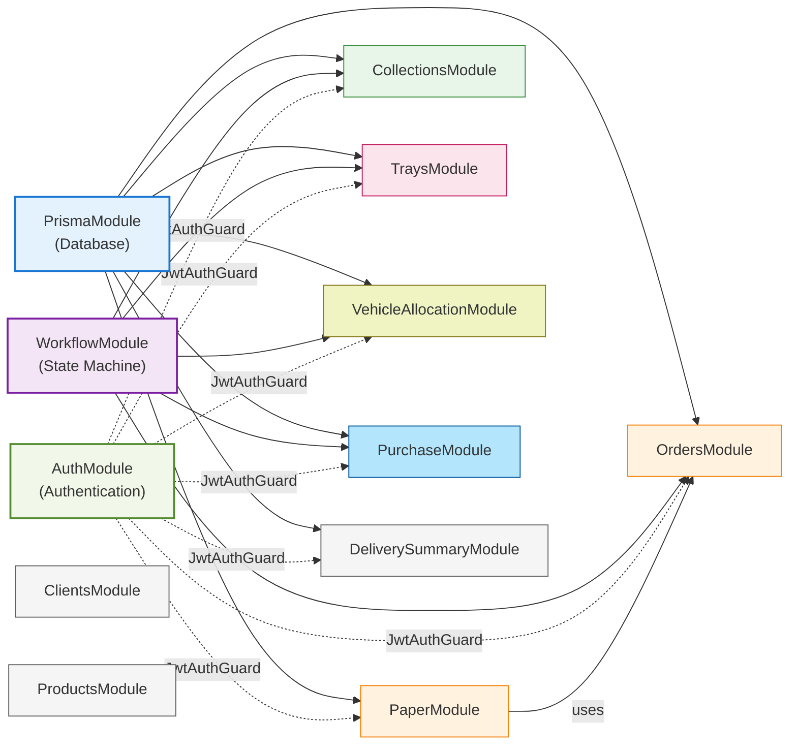

# Feature Modules Overview

## Summary

The Milk Distribution Server consists of **11 feature modules** organized by business domain:

| Module | Status | Purpose | Controllers | Services | Imports |
|--------|--------|---------|-------------|----------|---------|
| **Auth** | ✅ Complete | JWT authentication & RBAC | 1 | 2 | JwtModule, PassportModule |
| **Paper** | ✅ Complete | Daily order paper workflow | 1 | 2 | WorkflowModule |
| **Orders** | ✅ Complete | Order entry (night/morning) | 1 | 2 | PaperModule |
| **Collections** | ✅ Complete | Payment collection tracking | 1 | 2 | WorkflowModule |
| **Trays** | ✅ Complete | Tray inventory management | 1 | 2 | WorkflowModule |
| **Vehicle Allocation** | ✅ Complete | Daily vehicle load planning | 1 | 2 | WorkflowModule |
| **Purchase** | ✅ Complete | Procurement management | 1 | 2 | WorkflowModule |
| **Delivery Summary** | ✅ Complete | Billing group delivery reporting | 1 | 1 | PrismaModule |
| **Workflow** | ✅ Core | State machine validation | 0 | 1 | N/A |
| **Clients** | ⚠️ Stub | Client master data | 0 | 0 | N/A |
| **Products** | ⚠️ Stub | Product master data | 0 | 0 | N/A |

**Total**: 11 modules | **9 active** | **2 stubs** | **1 shared (Workflow)**

---

## Module Dependency Map



---

## Module Details

### 1. Auth Module ✅

**Purpose**: User authentication and role-based access control

**Location**: `src/modules/auth/`

**Files**:
```
auth/
├── auth.controller.ts      # POST /auth/login, GET /auth/me
├── auth.service.ts         # JWT token generation, password verification
├── auth.repository.ts      # User lookup queries
├── auth.module.ts          # Module definition
├── auth.guard.ts           # JwtAuthGuard for request validation
├── roles.guard.ts          # RolesGuard for @Roles decorator
├── roles.decorator.ts      # @Roles() decorator definition
├── auth.constants.ts       # Config constants
├── jwt.strategy.ts         # Passport JWT strategy
└── dto/
    └── login.dto.ts        # LoginDto {username, password}
```

**Key Components**:
- **JwtAuthGuard**: Validates JWT token on every protected endpoint
- **RolesGuard**: Checks user role against @Roles decorator
- **Roles Decorator**: Declares required roles per endpoint
- **JwtStrategy**: Passport strategy for token extraction
- **AuthService**: Login logic with bcrypt password verification

**Dependencies**:
- `@nestjs/jwt` - Token generation
- `@nestjs/passport` - Authentication middleware
- `passport-jwt` - JWT strategy
- `bcrypt` - Password hashing

**Used By**: All modules use JwtAuthGuard and RolesGuard

---

### 2. Paper Module ✅

**Purpose**: Daily order paper workflow orchestration

**Location**: `src/modules/paper/`

**Files**:
```
paper/
├── paper.controller.ts           # POST /papers, POST /:id/submit-*, POST /:id/finalize, POST /:id/reopen
├── paper.service.ts              # Core workflow logic
├── paper.repository.ts           # Data access for papers and sheets
├── paper.module.ts               # Module definition
├── paper.constants.ts            # Constants, error messages, date config
├── paper-validation.service.ts   # Custom validation (night/morning readiness)
└── (no DTOs - body validation minimal)
```

**Key Services**:
- **PaperService**
  - `generatePaperService(date)` - Create daily paper and sheets
  - `getTodayPaperService()` - Get today or latest paper
  - `submitNightEntryService(paperId)` - Lock night entries → NIGHT_SUBMITTED
  - `submitMorningEntryService(paperId)` - Lock morning entries → MORNING_SUBMITTED
  - `finalizePaperService(paperId)` - Finalize → FINALIZED
  - `reopenPaperService(paperId, reason)` - Reopen for corrections

- **PaperValidationService**
  - `validateNightSubmitReadiness(paperId)` - Check if all night entries are complete
  - `validateMorningSubmitReadiness(paperId)` - Check if morning entries are entered
  - Validates business rules before transitions

Key Logic:
- Creates order_paper
- Creates order_sheet records for all active groups
- Does not create purchase_paper during paper generation
- Purchase, vehicle allocation, and tray workflow records are created on demand by their respective modules

**Dependencies**: WorkflowModule, PrismaModule

---

### 3. Orders Module ✅

**Purpose**: Order entry - night and morning submission

**Location**: `src/modules/orders/`

**Files**:
```
orders/
├── orders.controller.ts      # GET /orders/sheet/:id, POST /orders/sheet/:id/night-save, POST /orders/sheet/:id/morning-save
├── orders.service.ts         # Order entry logic
├── orders-validation.service.ts         # Order validation logic
├── orders.repository.ts      # Data access (order_sheet_items CRUD)
├── orders.module.ts          # Module definition
├── orders.constants.ts       # Constants
├── orders.builder.ts       # Response structure and AG Grid structure
└── dto/
    ├── save-night-entries.dto.ts       # SaveNightEntriesDto[]
    └── save-morning-entries.dto.ts     # SaveMorningEntriesDto[]
```

**DTOs**:
- **SaveNightEntriesDto**
  ```typescript
  {
    clientId: number,        // ✓ Required
    productId: number,       // ✓ Required
    orderedQty: number       // 0-10000, ✓ Required
  }
  ```

- **SaveMorningEntriesDto**
  ```typescript
  {
    clientId: number,        // ✓ Required
    productId: number,       // ✓ Required
    deliveredQty: number     // 0-10000, ✓ Required
  }
  ```

**Key Services**:
- `getSheetService(sheetId)` - Fetch order sheet with items
- `getSheetItemsService(sheetId)` - Get all items for sheet
- `saveNightEntriesService(sheetId, entries)` - Save ordered quantities in DRAFT state
- `saveMorningEntriesService(sheetId, entries)` - Save delivered quantities in NIGHT_SUBMITTED state

**Restrictions**:
- Night entries: Editable in DRAFT state only
- Morning entries: Editable in NIGHT_SUBMITTED or REOPENED states
- Role: EMPLOYEE

**Dependencies**: WorkflowModule, PrismaModule

**Note**: Legacy module; new code should use PaperModule for workflow operations.

---

### 4. Collections Module ✅

**Purpose**: Payment collection tracking

**Location**: `src/modules/collections/`

**Files**:
```
collections/
├── collections.controller.ts      # GET /collections/sheet/:id, POST /collections/sheet/:id/*-save
├── collections.service.ts         # Collection tracking logic
├── collections.repository.ts      # Data access
├── collections.module.ts          # Module definition
├── collections.builder.ts          # response structure and ag grid structure
└── dto/
    ├── save-night-collection.dto.ts       # SaveNightCollectionsDto
    ├── save-morning-collection.dto.ts     # SaveMorningCollectionsDto
    ├── save-admin-collection.dto.ts       # SaveAdminCollectionsDto
    └── save-employee-collections.dto.ts   # SaveEmployeeCollectionsDto
```

**DTOs**:
- **SaveNightCollectionsDto**
  ```typescript
  {
    entries: {
      clientId: number,           // ✓ Required
      officeAmountGiven: number   // ≥ 0
    }[]
  }
  ```

- **SaveMorningCollectionsDto** - Similar structure
- **SaveAdminCollectionsDto** - Admin-specific collection data
- **SaveEmployeeCollectionsDto** - Employee collection remarks

**Key Services**:
- `getCollectionGrid(sheetId)` - Fetch all collections for sheet with client details
- saveNightCollections()
  DRAFT, REOPENED

- saveMorningCollections() - NIGHT_SUBMITTED, REOPENED

- saveAdminCollections()- - MORNING_SUBMITTED, REOPENED

**Collection Types** (all Decimal 12,2):
- `cash_collection` - Cash received
- `cheque_collection` - Cheque received
- `online_collection` - Online transfer received
- `bank_deposit` - Bank deposit amount
- `office_amount_given` - Advance amount given to client

**Edit Rules** (per WorkflowStateService):
- DRAFT:
  Night Collections

- NIGHT_SUBMITTED:
  Night Collections
  Morning Collections

- MORNING_SUBMITTED:
  Admin Collections

- REOPENED:
  Night Collections
  Morning Collections
  Admin Collections

**Dependencies**: WorkflowModule, PrismaModule

---

### 5. Trays Module ✅

**Purpose**: Tray inventory and exchange tracking

**Location**: `src/modules/trays/`

**Files**:
```
trays/
├── trays.controller.ts      # GET /trays/sheet/:id, POST /trays/sheet/:id/save
├── trays.service.ts         # Tray exchange logic
├── trays.repository.ts      # Data access
├── trays.module.ts          # Module definition
├── trays.builder.ts          # response structure and ag grid structure
└── dto/
    └── save-trays-entries.dto.ts     # SaveTrayReturnDto[]
```

**DTOs**:
- **SaveTrayReturnDto**
  ```typescript
  {
    clientId: number,        // ✓ Required (client identifier)
    trayTypeId: number,      // ✓ Required (tray type identifier)
    returned: number         // ≥ 0, only operator-entered field
  }
  ```

**Key Services**:
- `getTraySheetService(sheetId)` - Fetch tray transactions with:
  - opening_balance (from last day)
  - expected trays (derived from order quantities)
  - closing_balance (auto-calculated)

- `saveTrayEntriesService(sheetId, entries)` - Save tray returns

**Tray Flow**:
```
opening_balance = previous day's closing_balance
+ trays_taken (from orders quantity)
- trays_returned (operator input)
= closing_balance
```

**Edit Rules**: NIGHT_SUBMITTED, REOPENED states only

**Dependencies**: WorkflowModule, PrismaModule

---

### 6. Vehicle Allocation Module ✅

**Purpose**: Daily vehicle load planning and distributor assignment

**Location**: `src/modules/vehicle-allocation/`

**Files**:
```
vehicle-allocation/
├── vehicle-allocation.controller.ts      # GET /vehicle-allocations/*, POST /vehicle-allocations/*
├── vehicle-allocation.service.ts         # Load allocation logic
├── vehicle-allocation.repository.ts      # Data access
├── vehicle-allocation.module.ts          # Module definition
├── vehicle-allocation.builder.ts           # response structure and ag grid structure
└── dto/
    └── save-vehicle-allocation.dto.ts    # SaveVehicleAllocationDto
```

**DTOs**:
- **SaveVehicleAllocationDto**
  ```typescript
  {
    allocations: {
      vehicleId: number,    // ✓ Required
      productId: number,    // ✓ Required
      allocatedQty: number  // ✓ Required
    }[],
    assignments: {
      vehicleId: number,     // ✓ Required (same vehicle)
      distributorId: number  // ✓ Required
    }[]
  }
  ```

**Key Services**:
- `getGroupSummary(paperId)` - Get group/vehicle summary for paper
- `getVehicleAllocations(paperId)` - Fetch all allocations
- `saveVehicleAllocations(paperId, dto)` - Save allocations + assignments

**Critical Rule**: ⚠️ **PERMANENT LOCK AFTER NIGHT_SUBMITTED**
- Editable: DRAFT state only
- NOT reopenable (even if paper is reopened)
- Reason: Affects purchase quantities and routes

**Edit Rules**: DRAFT state only

**Dependencies**: WorkflowModule, PrismaModule

---

### 7. Purchase Module ✅

**Purpose**: Procurement order management

**Location**: `src/modules/purchase/`

**Files**:
```
purchase/
├── purchase.controller.ts      # GET /purchases/:paperId, POST /purchases/:paperId
├── purchase.service.ts         # Purchase entry logic
├── purchase.repository.ts      # Data access
├── purchase.module.ts          # Module definition
├── purchase.builder.ts          # response structure and ag grid structure
└── dto/
    └── purchase.dto.ts         # SavePurchaseDto
```

**DTOs**:
- **SavePurchaseDto**
  ```typescript
  {
    entries: {
      distributorId: number,  // ✓ Required
      vehicleId: number,      // ✓ Required
      productId: number,      // ✓ Required
      purchasedQty: number    // ✓ Required
    }[]
  }
  ```

**Key Services**:
- `getPurchases(paperId)` - Fetch all purchase orders for paper
- `savePurchases(paperId, dto)` - Save purchase entries with:
  - purchase_rate (from distributor_product_rate)
  - purchase_amount (quantity × rate)
  - allocated_qty (optional, from vehicle_allocation)

**Purchase Workflow**:
1. Employee reviews vehicle allocations
2. Enters purchase quantities per distributor/vehicle/product
3. System looks up purchase rates from distributor_product_rate
4. Calculates purchase_amount automatically

**Edit Rules**: NIGHT_SUBMITTED, REOPENED states

**Dependencies**: WorkflowModule, PrismaModule

**Data Source**:
Purchase planning uses:
- delivery_group_id
- ordered_qty

Purchase does NOT use:
- billing_group_id
- delivered_qty

---

### 8. Delivery Summary Module ✅

**Purpose**: Billing-group based delivery reconciliation and reporting

**Location**: `src/modules/delivery-summary/`

**Files**:
delivery-summary/
├── delivery-summary.controller.ts
├── delivery-summary.service.ts
├── delivery-summary.repository.ts
├── delivery-summary.builder.ts
├── delivery-summary.module.ts
└── delivery-summary.constants.ts


**DTOs**:
None (read-only reporting module)

**Key Services**:
- `getBillingGroupSummary(paperId)`
  - Groups data using `master_client.billing_group_id`
  - Uses `order_sheet_items.delivered_qty`
  - Generates billing-group summaries by:
    - Brand
    - Product Group
    - Product Type
    - Packaging Type
    - Packaging Size

**Billing Summary Rules**:
- Uses delivered quantities
- Uses billing groups
- Independent of order_sheet.group_id
- Uses client.billing_group_id instead
- Clients are grouped by `billing_group_id`
- Multiple delivery groups may contribute to the same billing group
- Billing team generates invoices from billing groups

**Purpose in Workflow**:
Used for:
- Billing reconciliation
- Delivery analysis
- Purchase vs delivered quantity comparison

Not used for:
- Vehicle allocation
- Purchase planning

**Edit Rules**:
Read-only module

**Dependencies**:
PrismaModule

**Endpoints**:

GET /delivery-summary/:paperId
  Returns billing-group summary using delivered quantities


### 9. Workflow Module ✅

**Purpose**: State machine validation (shared across modules)

**Location**: `src/modules/workflow/`

**Files**:
```
workflow/
├── workflow.module.ts           # Module definition (exported, no controllers)
└── workflow-state.service.ts    # State transition & edit permission validation
```

**WorkflowStateService Methods**:

**Transition Validation**:
```typescript
validateTransition(currentStatus, targetStatus): void
  DRAFT → NIGHT_SUBMITTED
  NIGHT_SUBMITTED → MORNING_SUBMITTED
  MORNING_SUBMITTED → FINALIZED
  FINALIZED ↔ REOPENED
```

**Edit Permission Methods**:
```typescript
canEditNightEntries(status):         status === DRAFT
canEditMorningEntries(status):       status === NIGHT_SUBMITTED || status === REOPENED
canEditVehicleAllocations(status):   status === DRAFT (PERMANENT)
canEditPurchases(status):            status === NIGHT_SUBMITTED || status === REOPENED
canEditTrays(status):                status === NIGHT_SUBMITTED || status === REOPENED
canEmployeeEditCollections(status):  status === DRAFT || status === NIGHT_SUBMITTED
canAdminEditCollections(status):     status === MORNING_SUBMITTED || status === REOPENED
canFinalize(status):                 status === MORNING_SUBMITTED || status === REOPENED
canEditNightCollections(status):     status === DRAFT || status === NIGHT_SUBMITTED || status === REOPENED

canEditMorningCollections(status):   status === NIGHT_SUBMITTED || status === REOPENED
```

**Used By**: All feature modules for validation

**Dependencies**: None (provides to others)

---

### 10. Clients Module ⚠️

**Purpose**: Client master data management

**Location**: `src/modules/clients/`

**Status**: Stub (module structure only, no implementation)

**Planned Features**:
- GET /clients - List all clients
- POST /clients - Create client
- PUT /clients/:id - Update client
- GET /clients/:id - Get client details
- Client rate management

---

### 11. Products Module ⚠️

**Purpose**: Product master data management

**Location**: `src/modules/products/`

**Status**: Stub (module structure only, no implementation)

**Planned Features**:
- GET /products - List products
- POST /products - Create product
- PUT /products/:id - Update product
- GET /products/:id - Get product details
- Hierarchical product structure (Brand → Group → Type → Packaging → Size)

---

## Module File Structure Pattern

Each active module follows this standard structure:

```
module-name/
├── {module}.controller.ts          # HTTP endpoint definitions
├── {module}.service.ts             # Business logic (public methods)
├── {module}.repository.ts          # Data access layer (Prisma queries)
├── {module}.module.ts              # NestJS module definition with imports/exports
├── {module}.constants.ts           # Configuration and constants
├── {module}-validation.service.ts  # Optional,Custom validation (if needed)
├── {module}.builder.ts             # response structure and ag grid structure
├── dto/                            #Optional
│   └── *.dto.ts                   # Data Transfer Objects (input validation)
└── (no .spec.ts files in this documentation scope)
```

---

## Module Import/Export Pattern

Each module follows this NestJS pattern:

```typescript
// {module}.module.ts
@Module({
  imports: [PrismaModule],  // Shared modules
  controllers: [{module}Controller],
  providers: [{module}Service, {module}Repository],
  exports: [{module}Service],  // For inter-module usage
})
export class {Module}Module {}
```

**Root Module** (`app.module.ts`) imports:
```typescript
imports: [
  PrismaModule,          // Required by all feature modules
  WorkflowModule,        // Core state machine (required by most)
  AuthModule,           // Security (used by all)
  OrdersModule,
  PaperModule,
  CollectionsModule,
  TraysModule,
  VehicleAllocationModule,
  PurchaseModule,
  DeliverySummaryModule,
  // ClientsModule,     // Stub (not imported yet)
  // ProductsModule,    // Stub (not imported yet)
]
```

---

## Module Interaction Example

**Complete night entry workflow**:

1. **Frontend**: POSTs to `/papers` (PaperModule)
   - Creates daily paper and order sheets

2. **Frontend**: POSTs to `/orders/sheet/:id/night-save` (OrdersModule)
   - Saves ordered quantities
   - Uses WorkflowStateService to verify DRAFT state

3. **Frontend**: POSTs to `/collections/sheet/:id/night-save` (CollectionsModule)
   - Saves office amounts

4. **Frontend**: POSTs to `/vehicle-allocations/:paperId/vehicle-allocations` (VehicleAllocationModule)
   - Allocates products to vehicles
   - Assigns distributors

5. **Frontend**: POSTs to `/papers/:paperId/submit-night` (PaperModule)
   - Locks night entries
   - Transitions to NIGHT_SUBMITTED
   - Uses WorkflowStateService to validate transition


**Result**: 
- Night Entries locked
- Vehicle Allocations PERMANENTLY LOCKED (even in REOPENED)
- Night Collections still editable
- Morning workflow enabled

---
### Billing Reconciliation Workflow

1. Morning entries are completed
2. Delivered quantities are saved
3. Frontend calls GET /delivery-summary/:paperId
4. System groups data using billing_group_id
5. Billing summaries are generated
6. Billing groups are compared against purchase quantities
7. Billing team generates invoices
## Next Steps

For detailed documentation on specific modules, see:
- [4-AUTH_MODULE.md](4-AUTH_MODULE.md) - Deep dive into authentication
- [5-ORDERS_PAPER_MODULES.md](5-ORDERS_PAPER_MODULES.md) - Orders & Paper workflow
- [6-COLLECTIONS_TRAYS_MODULES.md](6-COLLECTIONS_TRAYS_MODULES.md) - Collections & Trays
- [7-VEHICLE_PURCHASE_MODULES.md](7-VEHICLE_PURCHASE_MODULES.md) - Vehicle & Purchase
- [8-API_ENDPOINTS.md](8-API_ENDPOINTS.md) - All API endpoints with cURL examples

---

**Last Updated**: 2026-06-17
