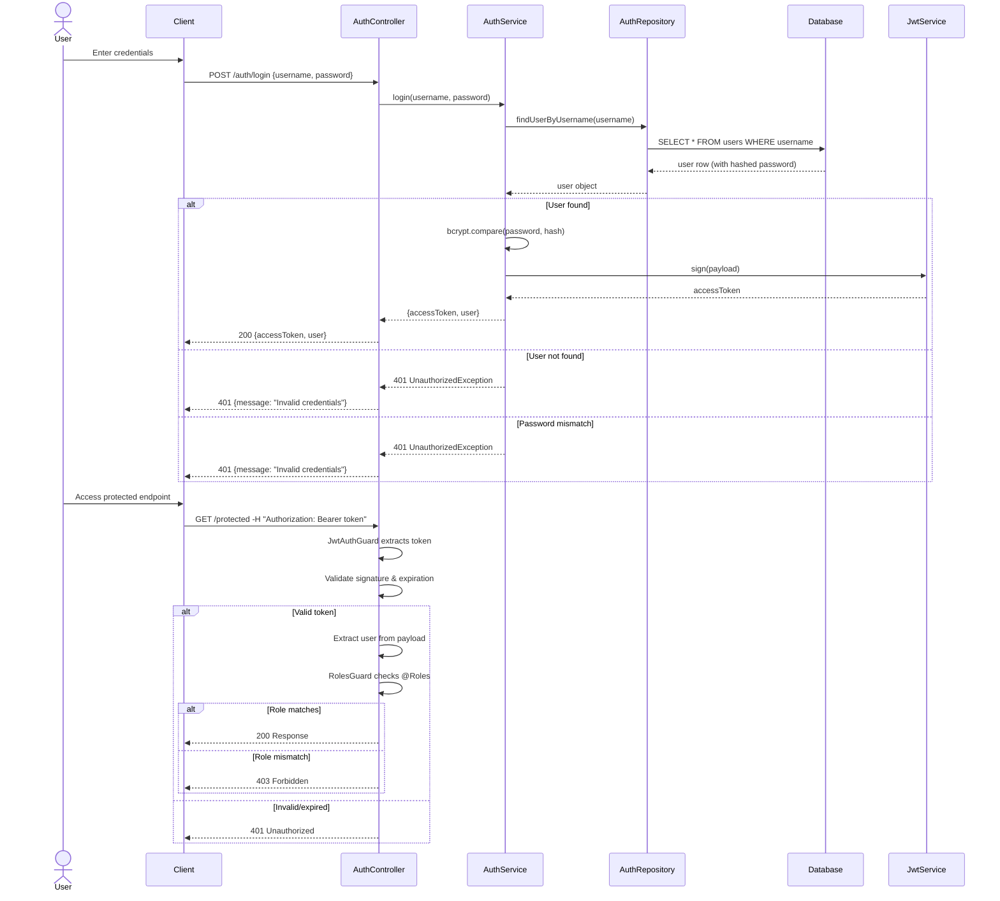

# Authentication Module (Auth)

## Overview

The **Auth Module** provides JWT-based authentication and role-based access control (RBAC) for the Milk Distribution Server. It implements secure login, token generation, and endpoint protection.

**Location**: `src/modules/auth/`

---

## Architecture

```mermaid
graph LR
    Request["Incoming Request"]
    JwtGuard["JwtAuthGuard"]
    RolesGuard["RolesGuard"]
    JwtStrategy["JwtStrategy"]
    AuthService["AuthService"]
    Repository["AuthRepository"]
    Database["Database<br/>users, roles"]
    
    Request -->|@UseGuards| JwtGuard
    JwtGuard -->|validates token| JwtStrategy
    JwtGuard -->|applies| RolesGuard
    AuthService -->|queries| Repository
    Repository -->|SQL| Database
    
    style JwtGuard fill:#f3e5f5,stroke:#7b1fa2,stroke-width:2px
    style RolesGuard fill:#f3e5f5,stroke:#7b1fa2,stroke-width:2px
    style AuthService fill:#fff3e0,stroke:#f57c00,stroke-width:2px
    style Repository fill:#e8f5e9,stroke:#388e3c
    style Database fill:#e3f2fd,stroke:#1976d2
```

---

## File Structure

```
auth/
├── auth.controller.ts          # HTTP endpoints
├── auth.service.ts             # Login & token logic
├── auth.repository.ts          # User queries
├── auth.module.ts              # Module definition
├── auth.guard.ts               # JwtAuthGuard
├── roles.guard.ts              # RolesGuard
├── roles.decorator.ts          # @Roles() decorator
├── jwt.strategy.ts             # Passport JWT strategy
├── auth.constants.ts           # Config constants
└── dto/
    └── login.dto.ts            # LoginDto
```

---

## Controllers & Endpoints

### AuthController

**Location**: `src/modules/auth/auth.controller.ts`

```typescript
@Controller('auth')
export class AuthController {
  constructor(private readonly authService: AuthService) {}

  @Post('login')
  async login(@Body() dto: LoginDto) {
    return this.authService.login(dto.username, dto.password);
  }

  @Get('me')
  @UseGuards(JwtAuthGuard)
  getMe(@Req() req: AuthRequest) {
    return req.user;
  }
}
```

---

## Endpoints

### 1. POST /auth/login

**Purpose**: Authenticate user and receive JWT token

**Request**:
```bash
curl -X POST http://localhost:3000/auth/login \
  -H "Content-Type: application/json" \
  -d '{
    "username": "user1",
    "password": "password123"
  }'
```

**Request Body (LoginDto)**:
```typescript
{
  username: string;  // @IsString(), required
  password: string;  // @IsString(), @MinLength(1), required
}
```

**Response** (200 OK):
```json
{
  "accessToken": "eyJhbGciOiJIUzI1NiIsInR5cCI6IkpXVCJ9...",
  "user": {
    "id": 1,
    "username": "user1",
    "role": "EMPLOYEE"
  }
}
```

**Error Responses**:
- `401 Unauthorized`: Invalid username or password
  ```json
  {
    "statusCode": 401,
    "message": "Invalid credentials",
    "error": "Unauthorized"
  }
  ```

---

### 2. GET /auth/me

**Purpose**: Get current authenticated user information

**Auth**: Required (JwtAuthGuard)

**Request**:
```bash
curl -X GET http://localhost:3000/auth/me \
  -H "Authorization: Bearer <JWT_TOKEN>"
```

**Response** (200 OK):
```json
{
  "id": 1,
  "username": "user1",
  "role": "EMPLOYEE"
}
```

**Error Responses**:
- `401 Unauthorized`: Missing or invalid JWT token
  ```json
  {
    "statusCode": 401,
    "message": "Unauthorized",
    "error": "Unauthorized"
  }
  ```

---

## Services

### AuthService

**Location**: `src/modules/auth/auth.service.ts`

**Public Methods**:

#### `login(username: string, password: string)`

**Logic**:
1. Query user by username using AuthRepository
2. If user not found → throw `UnauthorizedException`
3. Compare provided password with bcrypt hash using `bcrypt.compare()`
4. If mismatch → throw `UnauthorizedException`
5. Create JWT payload with user ID, username, and role
6. Sign token using JwtService
7. Return token + user object

**Payload**:
```typescript
{
  sub: user.id,              // Subject (user ID)
  username: user.username,   // Username
  role: user.role.name      // Role name (EMPLOYEE | ADMIN)
}
```

**Example**:
```typescript
async login(username: string, password: string) {
  const user = await this.authRepository.findUserByUsername(username);
  
  if (!user) {
    throw new UnauthorizedException('Invalid credentials');
  }
  
  const isPasswordValid = await bcrypt.compare(password, user.password);
  
  if (!isPasswordValid) {
    throw new UnauthorizedException('Invalid credentials');
  }
  
  const payload = {
    sub: user.id,
    username: user.username,
    role: user.role.name,
  };
  
  const accessToken = this.jwtService.sign(payload);
  
  return {
    accessToken,
    user: {
      id: user.id,
      username: user.username,
      role: user.role.name,
    },
  };
}
```

---

## Data Transfer Objects (DTOs)

### LoginDto

**Location**: `src/modules/auth/dto/login.dto.ts`

```typescript
export class LoginDto {
  @IsString()
  username!: string;

  @IsString()
  @MinLength(1)
  password!: string;
}
```

**Validation Rules**:
- `username`: Must be string, required
- `password`: Must be string, minimum 1 character, required

**Example**:
```json
{
  "username": "user1",
  "password": "password123"
}
```

---

## Guards

### JwtAuthGuard

**Location**: `src/modules/auth/auth.guard.ts`

```typescript
@Injectable()
export class JwtAuthGuard extends AuthGuard('jwt') {}
```

**Purpose**: Validate JWT token on protected endpoints

**How It Works**:
1. Extracts JWT from `Authorization: Bearer <token>` header
2. Validates token signature using JWT secret
3. Validates token expiration
4. Decodes token payload
5. Attaches user info to request object
6. Passes to next middleware if valid
7. Throws `UnauthorizedException` if invalid or expired

**Usage**:
```typescript
@Post('papers')
@UseGuards(JwtAuthGuard)
async generatePaper(@Body('date') date: string) {
  // Only reached if JWT is valid
}
```

**Attached to Request**:
```typescript
type AuthRequest = Request & {
  user: {
    id: number;
    username: string;
    role: string;
  };
};
```

---

### RolesGuard

**Location**: `src/modules/auth/roles.guard.ts`

```typescript
const roleHierarchy = {
  ADMIN: 2,
  EMPLOYEE: 1,
};

return (
  roleHierarchy[user.role] >=
  Math.max(
    ...requiredRoles.map(
      role => roleHierarchy[role],
    ),
  )
);
```

**Purpose**: Enforce role-based access control

**How It Works**:
1. Reads @Roles decorator from endpoint
2. If no @Roles: allows any authenticated user
3. ADMIN inherits EMPLOYEE permissions.
   @Roles('EMPLOYEE') → EMPLOYEE and ADMIN allowed
   @Roles('ADMIN') → ADMIN only
4. Returns true if authorized, false if not
5. NestJS returns `403 Forbidden` if false

**Usage**:
```typescript
@Post('finalize')
@Roles('ADMIN')
@UseGuards(JwtAuthGuard, RolesGuard)
async finalizePaper(@Param('paperId') paperId: number) {
  // Only ADMIN role can access
}

@Get('sheet/:id')
@Roles('EMPLOYEE')  // Multiple roles
@UseGuards(JwtAuthGuard, RolesGuard)
async getSheet(@Param('id') id: number) {
  // Both EMPLOYEE and ADMIN can access
}
```

---

## Decorators

### @Roles

**Location**: `src/modules/auth/roles.decorator.ts`

```typescript
export const ROLES_KEY = 'roles';

export const Roles = (...roles: string[]) =>
  SetMetadata(ROLES_KEY, roles);
```

**Purpose**: Declare required roles for an endpoint

**Usage**:
```typescript
@Post('finalize')
@Roles('ADMIN')
async finalizePaper() { }

@Get('sheet/:id')
@Roles('EMPLOYEE')
async getSheet() { }

@Get('public')
// No @Roles decorator - any authenticated user
async publicEndpoint() { }
```

---

## Authentication Strategy

### JwtStrategy

**Location**: `src/modules/auth/jwt.strategy.ts`

```typescript
@Injectable()
export class JwtStrategy extends PassportStrategy(Strategy) {
  constructor() {
  super({
    jwtFromRequest: ExtractJwt.fromAuthHeaderAsBearerToken(),
    ignoreExpiration: false,
    secretOrKey: 'milk-distribution-secret',
  });
}

  async validate(payload: any) {
    return {
  id: payload.sub,
  username: payload.username,
  role: payload.role,
};
  }
}
```

**Purpose**: Passport strategy for JWT extraction and validation

**Configuration**:
- **jwtFromRequest**: Extract from `Authorization: Bearer <token>` header
- **ignoreExpiration**: false (enforce expiration)

---

## Module Definition

**Location**: `src/modules/auth/auth.module.ts`

```typescript
@Module({
  imports: [
    PrismaModule,
    JwtModule.register({
      secret: 'milk-distribution-secret' //->just a reference not proper value,
      signOptions: { expiresIn:'1d' },
    }),
    PassportModule,
  ],
  controllers: [AuthController],
  providers: [AuthService, AuthRepository, JwtStrategy],
})
export class AuthModule {}
```

**Imports**:
- **PrismaModule**: Database access
- **JwtModule**: Token generation/validation
- **PassportModule**: Passport integration


---

## Repository

### AuthRepository

**Location**: `src/modules/auth/auth.repository.ts`

**Methods**:

#### `findUserByUsername(username: string)`

**Query**:
```typescript
async findUserByUsername(username: string) {
  return this.prisma.users.findUnique({
    where: { username },
    include: { role: true },
  });
}
```

**Result**:
```typescript
{
  id: number,
  username: string,
  email: string,
  password: string,        // bcrypt hash
  first_name: string,
  last_name: string,
  role: {
    id: number,
    name: string           // 'EMPLOYEE' | 'ADMIN'
  },
  created_at: Date,
  updated_at: Date
}
```

**Note**: Never expose `password` field in API responses

---

## Data Models

### users

**Table**: `users`

```typescript
{
  id:         Int       @id @default(autoincrement())
  username:   String    @unique
  email:      String    @unique
  password:   String            // bcrypt hash
  first_name: String
  last_name:  String
  role_id:    Int       @FK
  role:       roles     @relation
  created_at: DateTime  @default(now())
  updated_at: DateTime  @updatedAt
}
```

### roles

**Table**: `roles`

```typescript
{
  id:    Int      @id @default(autoincrement())
  name:  String   @unique           // 'EMPLOYEE' | 'ADMIN'
  users: users[]  @relation
}
```

---

## Security Best Practices

### Password Hashing

**Implementation**: bcrypt with 10 salt rounds

```typescript
// Hashing (when creating user - not in this module)
const hash = await bcrypt.hash(plainPassword, 10);

// Verification (in AuthService)
const isValid = await bcrypt.compare(plainPassword, hash);
```

**Benefits**:
- Irreversible hashing
- Constant-time comparison (prevents timing attacks)
- Automatic salt generation
- Slow by design (millions of iterations)

### JWT Security

**Token Content**:
```json
{
  "sub": 1,
  "username": "user1",
  "role": "EMPLOYEE"
}
```

**Security Measures**:
- Token signed with secret key (HMAC SHA-256)
- Expiration enforced (cannot be used after expiry)
- Cannot modify token payload without invalidating signature
- Stateless (no server-side session storage needed)

### Header Validation

**Required Header**:
```
Authorization: Bearer <JWT_TOKEN>
```

**Validation**:
- Must include `Authorization` header
- Must start with `Bearer `
- Token must be valid JWT format
- Token signature must match secret
- Token must not be expired

---


### JWT Configuration

Current implementation:

```typescript
JwtModule.register({
  secret: 'milk-distribution-secret',
  signOptions: {
    expiresIn: '1d',
  },
})
```


## Error Handling

### Invalid Credentials

```bash
curl -X POST http://localhost:3000/auth/login \
  -d '{"username":"admin","password":"wrong"}'
```

**Response** (401):
```json
{
  "statusCode": 401,
  "message": "Invalid credentials",
  "error": "Unauthorized"
}
```

### Missing JWT Token

```bash
curl -X GET http://localhost:3000/auth/me
# No Authorization header
```

**Response** (401):
```json
{
  "statusCode": 401,
  "message": "Unauthorized",
  "error": "Unauthorized"
}
```

### Expired Token

```bash
curl -X GET http://localhost:3000/auth/me \
  -H "Authorization: Bearer <EXPIRED_TOKEN>"
```

**Response** (401):
```json
{
  "statusCode": 401,
  "message": "Unauthorized",
  "error": "Unauthorized"
}
```

### Insufficient Permissions

```bash
curl -X POST http://localhost:3000/papers/1/finalize \
  -H "Authorization: Bearer <EMPLOYEE_TOKEN>"
```

**Response** (403):
```json
{
  "statusCode": 403,
  "message": "Forbidden",
  "error": "Forbidden"
}
```

---

## Workflow Example

**Complete authentication flow**:



---

## Integration with Other Modules

### Usage Pattern

All protected endpoints follow this pattern:

```typescript
@Controller('papers')
@UseGuards(JwtAuthGuard, RolesGuard)  // Applied to all endpoints
export class PaperController {
  
  @Post()
  @Roles('EMPLOYEE')  // Specific role required
  async generatePaper() { }
  
  @Post(':paperId/finalize')
  @Roles('ADMIN')  // Different role
  async finalizePaper() { }
  
  @Get('today')
  // No @Roles = any authenticated user
  async getTodayPaper() { }
}
```

### User Context in Services

```typescript
// AuthRequest contains user info
@Post('endpoint')
@UseGuards(JwtAuthGuard)
async handler(
  @Req() req: AuthRequest,
  @Body() dto: SomeDto
) {
  const userId = req.user.id;
  const userRole = req.user.role;
  // Use in business logic
  return this.service.process(userId, userRole, dto);
}
```

---

## Testing

### Mock Authentication

```typescript
// In test setup
const mockUser = {
  sub: 1,
  username: 'testuser',
  role: 'EMPLOYEE',
};

// Mock guard
const mockAuthGuard = {
  canActivate: jest.fn(() => true),
};

// Override provider
{
  provide: APP_GUARD,
  useValue: mockAuthGuard,
}
```

### Test Login Endpoint

```typescript
it('should return token on valid credentials', async () => {
  const response = await request(app.getHttpServer())
    .post('/auth/login')
    .send({ username: 'user1', password: 'password123' })
    .expect(200);
  
  expect(response.body).toHaveProperty('accessToken');
  expect(response.body.user.username).toBe('user1');
});

it('should return 401 on invalid credentials', async () => {
  await request(app.getHttpServer())
    .post('/auth/login')
    .send({ username: 'user1', password: 'wrong' })
    .expect(401);
});
```

---

## Summary

The **Auth Module** provides:
- ✅ Secure login with bcrypt password hashing
- ✅ JWT token generation with configurable expiration
- ✅ Stateless authentication (no sessions)
- ✅ Role-based access control via decorators
- ✅ Guard-based endpoint protection
- ✅ Type-safe user context in requests

**Key Files**: auth.controller.ts, auth.service.ts, auth.guard.ts, roles.decorator.ts

**Dependencies**: JwtModule, PassportModule, PrismaModule

**Used By**: All modules (controllers protected with @UseGuards(JwtAuthGuard, RolesGuard))

---

**Last Updated**: 2026-06-16
