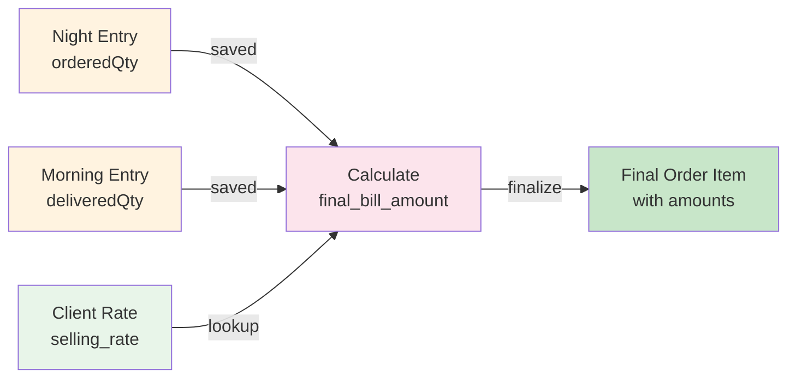

# Orders & Paper Modules

## Overview

The **Orders Module** and **Paper Module** work together to orchestrate the daily order workflow:
- **PaperModule**: Daily paper creation, state transitions (night submit, morning submit, finalize, reopen)
- **OrdersModule**: Night and morning order entry

---

## Paper Module (Primary Workflow Orchestrator)

### Files

```
paper/
├── paper.controller.ts
├── paper.service.ts
├── paper.repository.ts
├── paper.module.ts
├── paper.constants.ts
├── paper-validation.service.ts

```

### Controller: PaperController

**Location**: `src/modules/paper/paper.controller.ts`

```typescript
@Controller('papers')
@UseGuards(JwtAuthGuard, RolesGuard)
export class PaperController {
  constructor(private readonly paperService: PaperService) {}

  @Post()
  @Roles('EMPLOYEE')
  async generatePaper(@Body('date') date: string) { }

  @Get('today')
  @Roles('EMPLOYEE')
  async getTodayPaper() { }

  @Post(':paperId/submit-night')
  @Roles('EMPLOYEE')
  async submitNightEntry(@Param('paperId', ParseIntPipe) paperId: number) { }

  @Post(':paperId/submit-morning')
  @Roles('EMPLOYEE')
  async submitMorningEntry(@Param('paperId', ParseIntPipe) paperId: number) { }

  @Post(':paperId/finalize')
  @Roles('ADMIN')
  async finalizePaper(@Param('paperId', ParseIntPipe) paperId: number) { }

  @Post(':paperId/reopen')
  @Roles('ADMIN')
  async reopenPaper(
    @Param('paperId', ParseIntPipe) paperId: number,
    @Body('reason') reason: string,
  ) { }
}
```

---

### Endpoints

#### 1. POST /papers

**Purpose**: Generate daily order paper with order sheets for all groups

**Auth**: EMPLOYEE

**Request**:
```bash
curl -X POST http://localhost:3000/papers \
  -H "Authorization: Bearer <TOKEN>" \
  -H "Content-Type: application/json" \
  -d '{"date": "2026-06-17"}'
```

**Request Body**:
```json
{
  "date": "YYYY-MM-DD"  // String in ISO date format
}
```

**Validation**:
- Date must be string
- Date format must be YYYY-MM-DD
- Date cannot be in past
- Date cannot be more than 30 days in future

**Response** (200 OK):
```json
{
  "id": 1,
  "order_date": "2026-06-17",
  "sale_date": "2026-06-18",
  "status": "DRAFT",
  "night_entry_submitted_at": null,
  "morning_entry_submitted_at": null,
  "finalized_at": null,
  "reopened_at": null,
  "reopen_reason": null,
  "created_at": "2026-06-16T10:00:00Z",
  "updated_at": "2026-06-16T10:00:00Z",
}
```

**Error Response** (400):
```json
{
  "statusCode": 400,
  "message": "Date must be within 30 days",
  "error": "Bad Request"
}
```

---

#### 2. GET /papers/today

**Purpose**: Get today's paper or latest paper if today not created

**Auth**: EMPLOYEE

**Request**:
```bash
curl -X GET http://localhost:3000/papers/today \
  -H "Authorization: Bearer <TOKEN>"
```

**Response** (200 OK):
```json
{
  "type": "TODAY",
  "paper": {
    "id": 1,
    "order_date": "2026-06-16",
    "status": "DRAFT",
    "order_sheet": [ ... ]
  }
}
```

**Or if today not created**:
```json
{
  "type": "LATEST",
  "paper": {
    "id": 0,
    "order_date": "2026-06-15",
    "status": "FINALIZED",
    "order_sheets": [ ... ]
  }
}
```

---

#### 3. POST /papers/:paperId/submit-night

**Purpose**: Lock night entries and transition to NIGHT_SUBMITTED status

**Auth**: EMPLOYEE

**Request**:
```bash
curl -X POST http://localhost:3000/papers/1/submit-night \
  -H "Authorization: Bearer <TOKEN>"
```

**Validation:**
- Paper must be eligible for NIGHT_SUBMITTED transition
- Vehicle allocations must be complete
- Vehicle assignments must be complete
- Night entries must be complete
- Tray calculations must exist
- Night collections must be complete

**Response** (200 OK):
```json
{
  "id": 1,
  "status": "NIGHT_SUBMITTED",
  "night_entry_submitted_at": "2026-06-16T10:15:00Z",
  "updated_at": "2026-06-16T10:15:00Z"
}
```

**Error Response** (400):
```json
{
  "statusCode": 400,
  "message": "Cannot transition from DRAFT to NIGHT_SUBMITTED",
  "error": "Bad Request"
}
```

---

#### 4. POST /papers/:paperId/submit-morning

**Purpose**: Lock morning entries and transition to MORNING_SUBMITTED status

**Auth**: EMPLOYEE

**Request**:
```bash
curl -X POST http://localhost:3000/papers/1/submit-morning \
  -H "Authorization: Bearer <TOKEN>"
```

**Validation:**
- Paper must be eligible for MORNING_SUBMITTED transition
- Morning entries must be complete
- Quantity sanity validation must pass
- Tray returns must be complete
- Morning collections must be complete
- Purchases must be complete

**Response** (200 OK):
```json
{
  "id": 1,
  "status": "MORNING_SUBMITTED",
  "morning_entry_submitted_at": "2026-06-16T14:00:00Z",
  "updated_at": "2026-06-16T14:00:00Z"
}
```

---

#### 5. POST /papers/:paperId/finalize

**Purpose**: Finalize and lock the paper after all validations are complete

**Auth**: ADMIN only

**Request**:
```bash
curl -X POST http://localhost:3000/papers/1/finalize \
  -H "Authorization: Bearer <ADMIN_TOKEN>"
```

**Validation**:
- Paper must be eligible for FINALIZED transition
- Admin collections validation must pass for all sheets

**Response** (200 OK):
```json
{
  "id": 1,
  "status": "FINALIZED",
  "finalized_at": "2026-06-16T16:00:00Z",
  "updated_at": "2026-06-16T16:00:00Z"
}
```

---

#### 6. POST /papers/:paperId/reopen

**Purpose**: Reopen FINALIZED paper for corrections

**Auth**: ADMIN only

**Request**:
```bash
curl -X POST http://localhost:3000/papers/1/reopen \
  -H "Authorization: Bearer <ADMIN_TOKEN>" \
  -H "Content-Type: application/json" \
  -d '{"reason": "Client address correction needed"}'
```

**Request Body**:
```json
{
  "reason": "string"  // Why reopening?
}
```

**Response** (200 OK):
```json
{
  "id": 1,
  "status": "REOPENED",
  "reopened_at": "2026-06-17T09:00:00Z",
  "reopen_reason": "Client address correction needed",
  "updated_at": "2026-06-17T09:00:00Z"
}
```

**Critical Rules When Reopened**:
- Vehicle allocations: **PERMANENTLY LOCKED** (cannot modify)
- Morning entries: Editable again
- Night Collections: Editable
- Morning Collections: Editable
- Admin Collections: Editable
- Purchases: Editable again
- Trays: Editable again

---

### Service: PaperService

**Location**: `src/modules/paper/paper.service.ts`

**Public Methods**:

#### `generatePaperService(date: string)`

Logic:
1. Validate date format (YYYY-MM-DD)
2. Validate date is within allowed range (today to +30 days)
3. Check if paper already exists for that date
4. If paper exists, return existing paper
5. Create a new order paper with DRAFT status.
6. Load all active delivery groups.
7. Generate an order sheet for each active group.
8. Return the created paper.

---

#### `getTodayPaperService()`

Returns the current day's paper. If no paper exists for today, returns the most recent paper available.

**Logic:**
1. Look up today's paper using the current date range.
2. Return the paper as type `TODAY` when found.
3. Otherwise retrieve the latest paper by `order_date`.
4. Throw an exception if no papers exist.
5. Return the latest paper as type `LATEST`.
   
---

#### `submitNightEntryService(paperId: number)`

**Logic**:
1. Use PaperValidationService to validate night submission readiness
2. Validate workflow transition to NIGHT_SUBMITTED
3. Submit night entry through repository
4. Return updated paper
---

#### `submitMorningEntryService(paperId: number)`

**Logic**:
1. Use PaperValidationService to validate morning submission readiness
2. Validate workflow transition to MORNING_SUBMITTED
3. Submit morning entry through repository
4. Return updated paper

---

#### `finalizePaperService(paperId: number)`

**Logic**:
1. Use PaperValidationService to validate finalize readiness
2. Validate workflow transition to FINALIZED
3. Finalize paper through repository
4. Return updated paper

---

#### `reopenPaperService(paperId: number, reason: string)`

**Logic**:
1. Fetch paper by ID
2. Validate paper exists
3. Validate workflow transition to REOPENED
4. Reopen paper through repository
5. Return updated paper
---

### Validation Service

**Location**: `src/modules/paper/paper-validation.service.ts`

#### `validateNightSubmitReadiness(paperId)`

Validates that a paper is ready to transition to the `NIGHT_SUBMITTED` state.


**Checks:**
1. Paper exists.
2. Vehicle allocations validation passes.
3. Vehicle assignments validation passes.
4. Every sheet contains completed night order entries.
5. Tray calculations can be generated for every sheet.
6. Night collection validation passes for every sheet.

**Returns:**
- The validated paper.

**Throws:**
- `BadRequestException` when any validation fails.

---

#### `validateMorningSubmitReadiness(paperId)`

Validates that a paper is ready to transition to the `MORNING_SUBMITTED` state.

**Checks:**
1. Paper exists.
2. Morning entries are complete.
3. Quantity sanity validation passes.
4. Tray return completeness validation passes.
5. Morning collection validation passes.
6. Purchase validation passes.

**Returns:**
- The validated paper.

**Throws:**
- `BadRequestException` when any validation fails.


---

#### validateFinalizeReadiness(paperId)

Validates that a paper is ready to transition to the `FINALIZED` state.

**Checks:**
1. Paper exists.
2. Admin collection validation passes for every sheet.

**Returns:**
- The validated paper.

**Throws:**
- `BadRequestException` when any validation fails.
---

## Orders Module (Order Entry)

### Files

```
orders/
├── orders.controller.ts
├── orders.service.ts
├── orders-validation.service.ts
├── orders.repository.ts
├── order-billing.builder.ts
├── orders.module.ts
├── dto/
│   ├── save-night-entries.dto.ts
│   └── save-morning-entries.dto.ts
└── orders.constants.ts
```

---

### Controller: OrdersController

**Location**: `src/modules/orders/orders.controller.ts`

```typescript
@Controller('orders')
@UseGuards(JwtAuthGuard, RolesGuard)
export class OrdersController {
  
  @Get('sheet/:sheetId')
  @Roles('EMPLOYEE')
  async getSheet(@Param('sheetId', ParseIntPipe) sheetId: number) { }

  @Get('sheet/:sheetId/items')
  @Roles('EMPLOYEE')
  async getSheetItems(@Param('sheetId') sheetId: string) { }

  @Post('sheet/:sheetId/night-save')
  @Roles('EMPLOYEE')
  async saveNightEntries(
    @Param('sheetId') sheetId: string,
    @Body() entries: SaveNightEntriesDto[],
  ) { }

  @Post('sheet/:sheetId/morning-save')
  @Roles('EMPLOYEE')
  async saveMorningEntries(
    @Param('sheetId') sheetId: string,
    @Body() entries: SaveMorningEntriesDto[],
  ) { }
}
```

---

### Endpoints

#### 1. GET /orders/sheet/:sheetId

**Purpose**: Get complete order-entry workspace including workflow state,
order billing grids, tray billing and collection billing.

**Auth**: EMPLOYEE

**Request**:
```bash
curl -X GET http://localhost:3000/orders/sheet/1 \
  -H "Authorization: Bearer <TOKEN>"
```

**Response** (200 OK):
```json
{
  "sheet": {},

  "workflow": {},

  "milkGrid": {
    "columns": [],
    "rows": [],
    "totals": {}
  },

  "nonMilkGrid": {
    "columns": [],
    "rows": [],
    "totals": {}
  },

  "trayBilling": {
    "columns": [],
    "rows": [],
    "totals": {}
  },

  "collectionBilling": {
    "permissions": {},
    "columns": [],
    "rows": [],
    "totals": {}
  }
}
```

---

#### 2. GET /orders/sheet/:sheetId/items

**Purpose**: Get all items for a sheet (lighter query)

**Auth**: EMPLOYEE

**Request**:
```bash
curl -X GET http://localhost:3000/orders/sheet/1/items \
  -H "Authorization: Bearer <TOKEN>"
```

**Response** (200 OK):
```json
[
  {
    "id": 1,
    "order_sheet_id": 1,
    "client_id": 10,
    "product_id": 5,
    "ordered_qty": 100,
    "delivered_qty": 95
  }
]
```

---

#### 3. POST /orders/sheet/:sheetId/night-save

**Purpose**: Save night order quantities (in DRAFT state)

**Auth**: EMPLOYEE

**Request**:
```bash
curl -X POST http://localhost:3000/orders/sheet/1/night-save \
  -H "Authorization: Bearer <TOKEN>" \
  -H "Content-Type: application/json" \
  -d '[
    {
      "clientId": 10,
      "productId": 5,
      "orderedQty": 100
    },
    {
      "clientId": 10,
      "productId": 6,
      "orderedQty": 50
    }
  ]'
```

**Request Body (SaveNightEntriesDto[])** :
```typescript
[
  {
    clientId: number;      // @IsNumber(), @Min(1), ✓ required
    productId: number;     // @IsNumber(), @Min(1), ✓ required
    orderedQty: number;    // @IsNumber(), @Min(0), @Max(10000), ✓ required
  }
]
```

**Validation**:
- Quantity cannot be negative
- Quantity must satisfy configured precision rules

**Response** (200 OK):
```json
  {
  "success": true,
  "message": "Night entries saved successfully"
}


```

**Error Response** (400):
```json
{
  "statusCode": 400,
  "message": "Cannot save night entries in NIGHT_SUBMITTED state",
  "error": "Bad Request"
}
```

---

#### 4. POST /orders/sheet/:sheetId/morning-save

**Purpose**: Save morning delivery quantities (in NIGHT_SUBMITTED or REOPENED state)

**Auth**: EMPLOYEE

**Request**:
```bash
curl -X POST http://localhost:3000/orders/sheet/1/morning-save \
  -H "Authorization: Bearer <TOKEN>" \
  -H "Content-Type: application/json" \
  -d '[
    {
      "clientId": 10,
      "productId": 5,
      "deliveredQty": 95
    }
  ]'
```

**Request Body (SaveMorningEntriesDto[])**:
```typescript
[
  {
    clientId: number;        // @IsNumber(), @Min(1), ✓ required
    productId: number;       // @IsNumber(), @Min(1), ✓ required
    deliveredQty: number;    // @IsNumber(), @Min(0), @Max(10000), ✓ required
  }
]
```

**Validation:**
- Paper must be in NIGHT_SUBMITTED or REOPENED state
- Delivered quantity must satisfy quantity validation rules
- Corresponding night order entry must exist
- Extreme over-delivery is logged as a warning but does not block saving
  

**Response** (200 OK):
```json
{
  "success": true,
  "message": "Morning entries saved successfully"
}
```

### Service: OrdersService

**Location**: `src/modules/orders/orders.service.ts`

**Public Methods**:

#### `getSheetService(sheetId: number)`

Returns the complete sheet workspace required by the UI.

**Logic:**
1. Validate sheet exists.
2. Build order billing grids.
3. Load tray billing information.
4. Load collection billing information.
5. Determine workflow edit permissions.
6. Return sheet data, workflow state, order billing, tray billing and collection billing.

---

#### `getSheetItemsService(sheetId: number)`

**Logic**:
1. Query order_sheet_items for sheet
2. Return lightweight item list

---

#### `saveNightEntriesService(sheetId: number, entries: SaveNightEntriesDto[])`

**Logic:**
1. Validate sheet exists.
2. Validate workflow allows night editing.
3. Validate duplicate entries.
4. Validate client exists and is active.
5. Validate client belongs to the sheet group.
6. Validate product exists and is active.
7. Validate ordered quantity is provided.
8. Validate quantity rules and precision.
9. Resolve historical selling rate using paper order_date.
10. Calculate night bill amount.
11. Upsert order sheet entries within a transaction.
12. Return success response.

---

#### `saveMorningEntriesService(sheetId: number, entries: SaveMorningEntriesDto[])`

**Logic**:
1. Validate sheet exists.
2. Validate workflow allows morning editing.
3. Validate duplicate entries.
4. Validate delivered quantity is provided.
5. Validate quantity rules and precision.
6. Validate client exists and belongs to the sheet group.
7. Validate product exists and is active.
8. Validate a corresponding night order exists.
9. Resolve historical selling rate using paper order_date.
10. Calculate taxable amount.
11. Calculate GST amount.
12. Calculate final bill amount.
13. Update order sheet items within a transaction.
14. Return success response.


---

### DTOs

#### SaveNightEntriesDto

**Location**: `src/modules/orders/dto/save-night-entries.dto.ts`

```typescript
export class SaveNightEntriesDto {
  @IsNumber()
  @Min(1)
  clientId!: number;

  @IsNumber()
  @Min(1)
  productId!: number;

  @IsNumber()
  @Min(0)
  @Max(10000)
  orderedQty!: number;
}
```

---

#### SaveMorningEntriesDto

**Location**: `src/modules/orders/dto/save-morning-entries.dto.ts`

```typescript
export class SaveMorningEntriesDto {
  @IsNumber()
  @Min(1)
  clientId!: number;

  @IsNumber()
  @Min(1)
  productId!: number;

  @IsNumber()
  @Min(0)
  @Max(10000)
  deliveredQty!: number;
}
```


#### Builder: OrdersBillingBuilder

- Location: src/modules/orders/order-billing.builder.ts

**Purpose:**

- Builds order billing grids for UI consumption.
- Separates Milk and Non-Milk products.
- Generates AG Grid column structures using ProductColumnsBuilder.
- Calculates night and final billing totals.
- Produces summary totals for reporting and display.


**Public Methods**

- buildOrderBillingSection(sheet)

Input:

- order_sheet

Internal Data Loaded:
- Milk products
- Non-Milk products
- Clients
- Saved order_sheet_items

Logic:

1. Load active Milk products.
2. Load active Non-Milk products.
3. Generate dynamic product columns.
4. Load clients for the sheet's delivery group.
5. Load saved order entries.
6. Group entries by client.
7. Build Milk billing rows.
8. Build Non-Milk billing rows.
9. Calculate night billing totals.
10. Calculate final billing totals.
11. Return Milk and Non-Milk grid configurations.


**Returns:**
```ts
{
  milkGrid: {
    columns,
    rows,
    totals,
  },

  nonMilkGrid: {
    columns,
    rows,
    totals,
  },
}
```

---

### Orders Validation Service

**Location**: `src/modules/orders/orders-validation.service.ts`

The Orders Validation Service centralizes business validation rules used during order entry, workflow submissions, and billing calculations.

---

#### `validateProduct(productId: number, txClient?)`

Validates that a product exists and is active.

**Checks:**

1. Product exists.
2. Product is active.

**Returns:**

* The validated product.

**Throws:**

* `BadRequestException` if the product does not exist.
* `BadRequestException` if the product is inactive.

---

#### `validateClient(clientId: number, txClient?)`

Validates that a client exists and is active.

**Checks:**

1. Client exists.
2. Client is active.

**Returns:**

* The validated client.

**Throws:**

* `BadRequestException` if the client does not exist.
* `BadRequestException` if the client is inactive.

---

#### `validateClientInGroup(clientId: number, groupId: number, txClient?)`

Validates that a client belongs to the expected delivery group.

**Checks:**

1. Client exists.
2. Client belongs to the specified delivery group.

**Returns:**

* The validated client.

**Throws:**

* `BadRequestException` if the client does not exist.
* `BadRequestException` if the client does not belong to the specified group.

---

#### `validateNoDuplicates(entries)`

Validates that an order submission does not contain duplicate client-product combinations.

**Checks:**

1. Each `(clientId, productId)` combination appears only once.

**Throws:**

* `BadRequestException` if duplicate entries are detected.

---

#### `validateQuantity(qty: number)`

Validates operational quantity rules.

**Checks:**

1. Quantity is not negative.
2. Quantity satisfies configured precision requirements.

**Throws:**

* `BadRequestException` if quantity is negative.
* `BadRequestException` if quantity violates precision rules.

---

#### `validateNightEntriesComplete(sheetId: number, groupName: string)`

Validates that night order entry is complete for a sheet.

**Checks:**

1. The sheet contains order entries.
2. All order entries have an `ordered_qty` value.

**Throws:**

* `BadRequestException` if no orders exist for the sheet.
* `BadRequestException` if any night entry is incomplete.

---

#### `validateMorningEntriesComplete(sheetId: number)`

Validates that morning delivery entry is complete for a sheet.

**Checks:**

1. Every saved order item has a `delivered_qty` value.

**Throws:**

* `BadRequestException` if any delivered quantity is missing.

**Notes:**

* Empty sheets are considered valid and do not fail validation.

---

#### `validateQuantitySanity(sheetId: number)`

Performs additional validation on delivered quantities before morning submission.

**Checks:**

1. Delivered quantities are not negative.
2. Detects extreme over-delivery situations.

**Throws:**

* `BadRequestException` if negative delivered quantities are found.

**Warnings:**

* Over-delivery greater than 150% of ordered quantity is logged as a warning but does not block submission.

```
ordered_qty > 0
AND
delivered_qty > ordered_qty × 1.5
```


## Workflow States & Edit Rules

```
DRAFT
├─ ✅ Can enter: Night entries, Vehicle allocations, Collections (office amount)
├─ ❌ Locked: Morning entries, Purchases, Trays
└─ → Transition: NIGHT_SUBMITTED

NIGHT_SUBMITTED
├─ ✅ Can enter: - Morning Entries, Night Collections, Morning Collections, Purchases, Trays
├─ ❌ Locked: Night entries, Vehicle allocations (PERMANENT)
└─ → Transition: MORNING_SUBMITTED

MORNING_SUBMITTED
├─ ✅ Can enter: Admin collections only
├─ ❌ Locked: All employee operations
└─ → Transition: FINALIZED

FINALIZED
├─ ✅ Can enter: Nothing (locked)
└─ → Transition: REOPENED (admin only)

REOPENED
├─ ✅ Can enter: Morning entries,Night Collections, Morning Collections,Admin collections,Purchases, Trays
├─ ❌ Locked: Night entries, Vehicle allocations (PERMANENT even here)
└─ → Transition: FINALIZED (admin only)
```

---

## Order-to-Billing Flow


---

**Delivery Summary Flow**

After morning entry is completed, delivered_qty values become the
source data for Billing Group Summaries.

Unlike Night Group Summary:
- Night Group Summary uses delivery_group_id and ordered_qty.
- Billing Group Summary uses billing_group_id and delivered_qty.

---

## Summary

### Paper Module
- **Purpose**: Daily workflow orchestration
- **Key Operations**: Generate, submit night/morning, finalize, reopen
- **State Machine**: DRAFT → NIGHT_SUBMITTED → MORNING_SUBMITTED → FINALIZED ↔ REOPENED
- **Key Method**: generatePaperService(), submitNightEntryService(), submitMorningEntryService(), finalizePaperService(), reopenPaperService()

### Orders Module
- **Purpose**: Night and morning order entry
- **Key Operations**: Save night quantities, save morning quantities
- **Editable States**: DRAFT (night), NIGHT_SUBMITTED/REOPENED (morning)
- **Key Methods**: saveNightEntriesService(), saveMorningEntriesService()

---

**Last Updated**: 2026-06-16
