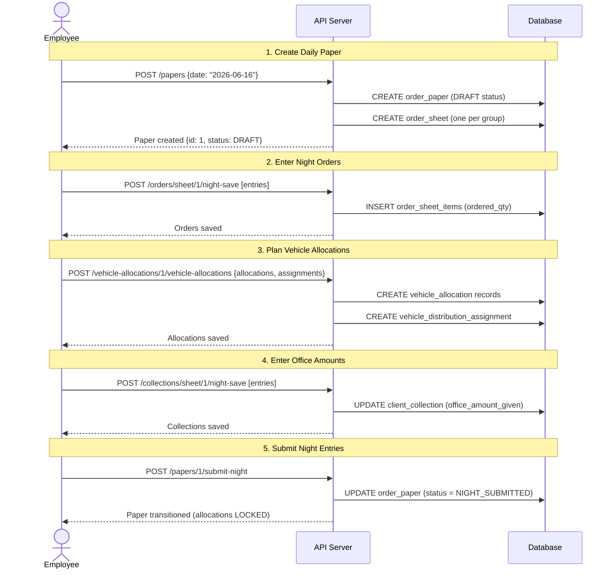
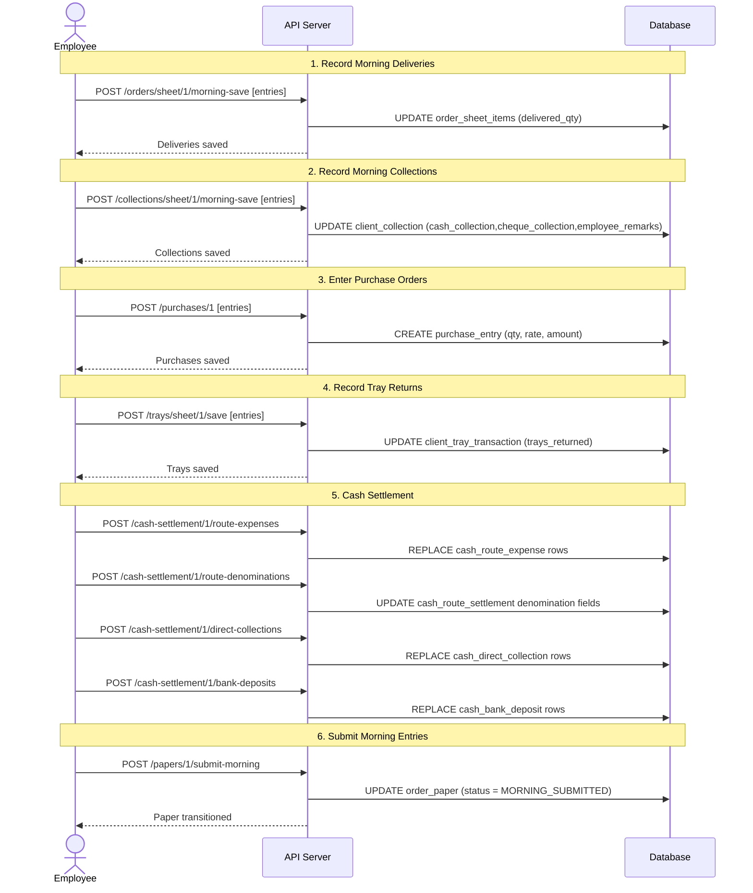
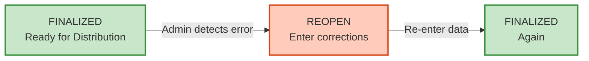
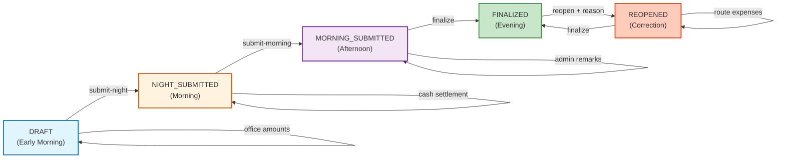

# End-to-End Workflows

## Complete Daily Order Workflow

### Overview

A complete paper lifecycle in the Milk Distribution system moves through these workflow states:

1. **DRAFT**
   - Night order entry
   - Vehicle allocation planning
   - Night collection / office amount entry

2. **NIGHT_SUBMITTED**
   - Morning delivery entry
   - Morning collections
   - Purchases
   - Trays
   - Cash Settlement

3. **MORNING_SUBMITTED**
   - Admin collection review
   - Admin collection entry
   - Final pre-close checks

4. **FINALIZED**
   - Business day closed
   - Reporting and audit state

5. **REOPENED** (only after finalization if correction is required)
   - Selected modules become editable again according to reopen rules
   - Cash Settlement becomes partly historical:
     - route expenses editable
     - route denominations read-only
     - direct collections read-only
     - bank deposits read-only

---

### Phase 1: DRAFT (Early Morning)

**Time**: 4:00 AM - 10:00 AM  
**Status**: DRAFT  
**Editable**:
- Night Orders
- Vehicle Allocations
- Night Collections (`office_amount_given`)



**Key Activities**:
1. System creates daily paper with one sheet per delivery group
2. Employee enters product quantities for each client
3. Employee allocates products to vehicles for optimal routes
4. Employee records cash received by the office during night collections
5. Employee locks night entries

**Restrictions After Step 5**:
- ❌ Cannot modify night orders
- ❌ Cannot modify vehicle allocations (PERMANENT LOCK)
- ✅ Can enter morning data
- ✅ Can enter purchases

---

### Phase 2: NIGHT_SUBMITTED (Morning to Afternoon)

**Time**: 10:00 AM - 2:00 PM  
**Status**: NIGHT_SUBMITTED  
**Editable**:
- Morning Deliveries
- Night collection office amounts (`office_amount_given`)
- Morning Collections
- Purchases
- Trays
- Cash Settlement



**Key Activities**:
1. Morning deliveries recorded (actual vs ordered quantities)
2. Billing group summary generated from delivered quantities
3. Client collections recorded (multiple payment methods)
4. Purchase orders entered
5. Tray exchanges recorded (returns by clients)
6. Cash settlement completed
7. Morning entries locked for admin review

**Restrictions After Step 6**:
- ❌ Cannot modify morning deliveries
- ❌ Cannot modify purchases
- ❌ Cannot modify trays
- ❌ Cannot modify cash settlement
- ❌ Cannot modify night collections after MORNING_SUBMITTED
- ✅ Admin can add collection remarks

---

### Phase 3: MORNING_SUBMITTED (Afternoon)

**Time**: 2:00 PM - 4:00 PM  
**Status**: MORNING_SUBMITTED  
**Editable**: Admin collections 

```mermaid
sequenceDiagram
    actor A as Admin
    participant API as API Server
    participant DB as Database
    
    Note over A,DB: 1. Review Collections
    A->>API: GET /collections/sheet/1
    API->>DB: SELECT client_collection with all amounts
    API-->>A: Collections grid
    
    Note over A,DB: 2. Add Admin Remarks
    A->>API: POST /collections/sheet/1/admin-save [entries]
    UPDATE client_collection (
  online_collection,
  bank_deposit,
  admin_remarks
)
    
    Note over A,DB: 3. Finalize Paper
    A->>API: POST /papers/1/finalize
    API->>DB: UPDATE order_paper (status = FINALIZED)
    API-->>A: Paper finalized
```

**Key Activities**:
1. Admin reviews all collections from employees
2. Admin records online collections, bank deposits and remarks
3. Admin finalizes paper

**Restrictions After Step 3**:
- ❌ Cannot modify anything
- ✅ Can reopen if needed

---

### Phase 4: FINALIZED (Evening & Beyond)

**Time**: 4:00 PM onwards  
**Status**: FINALIZED  
**Editable**: None (unless reopened)  



**If Error Detected**:
1. Admin clicks `POST /papers/:paperId/reopen`
2. Paper transitions to `REOPENED`
3. Admin can correct:
   - morning deliveries
   - night collections
   - morning collections
   - admin collections
   - purchases
   - trays
4. Vehicle allocations remain permanently locked
5. Cash Settlement follows reopen-specific rules:
   - route expenses remain editable
   - route denominations remain read-only historical rows
   - direct collections remain read-only historical rows
   - bank deposits remain read-only historical rows
6. Admin finalizes again

---

## Detailed User Workflows

### Workflow 1: New Daily Paper Creation

**User**: EMPLOYEE  
**Duration**: 5 minutes  
**Sequence**:

```bash
# 1. Get JWT token
TOKEN=$(curl -X POST http://localhost:3000/auth/login \
  -d '{"username":"emp1","password":"pass"}' \
  | jq -r '.accessToken')

# 2. Create paper for tomorrow
curl -X POST http://localhost:3000/papers \
  -H "Authorization: Bearer $TOKEN" \
  -d '{"date":"2026-06-17"}'

# Response:
 {
  "id": 1,
  "order_date": "2026-06-16",
  "sale_date": "2026-06-17",
  "status": "DRAFT",
  "night_entry_submitted_at": null,
  "morning_entry_submitted_at": null,
  "finalized_at": null,
  "reopened_at": null,
  "reopen_reason": null,
  "created_at": "2026-06-16T10:00:00Z",
  "updated_at": "2026-06-16T10:00:00Z",
}

echo "Paper created with ID: 1"

**Note**:
`order_paper.sale_date` is a paper-level date. Purchase/outstanding accounting must use `purchase_entry.gatepass_date`, which is resolved per purchase row from the product brand's `gatepass_date_policy`.
```

---

### Workflow 2: Night Order Entry

**User**: EMPLOYEE  
**Duration**: 30 minutes  
**Paper Status**: DRAFT  

```bash
# 1. Fetch order sheet for group 1
curl -X GET http://localhost:3000/orders/sheet/1 \
  -H "Authorization: Bearer $TOKEN"

# 2. Enter orders for 10 clients × 3 products each = 30 items
curl -X POST http://localhost:3000/orders/sheet/1/night-save \
  -H "Authorization: Bearer $TOKEN" \
  -d '  {
  "success": true,
  "message": "Night entries saved successfully"
}
'
```

---

### Workflow 3: Vehicle Allocation Planning

**User**: EMPLOYEE  
**Duration**: 20 minutes  
**Paper Status**: DRAFT  

```bash
# 1. Get group summary to see what products need allocation
curl -X GET http://localhost:3000/vehicle-allocations/group-summary/1 \
  -H "Authorization: Bearer $TOKEN"

# Response shows total quantities per product needed

# 2. Allocate to vehicles and assign distributors
curl -X POST http://localhost:3000/vehicle-allocations/1/vehicle-allocations \
  -H "Authorization: Bearer $TOKEN" \
  -d '{
    "allocations": [
      {
        "summaryKey": "1_2",
        "brandId": 1,
        "brandName": "Amul",
        "productGroupId": 2,
        "productGroupName": "Milk",
        "summaryTotal": {
          "product_10": 100,
          "product_11": 150
        },
        "columns": [
          {
            "headerName": "Amul Gold 1L",
            "field": "product_10",
            "productId": 10
          },
          {
            "headerName": "Amul Taaza 500ml",
            "field": "product_11",
            "productId": 11
          }
        ],
        "rows": [
          {
            "vehicleId": 1,
            "vehicleName": "Vehicle A",
            "product_10": 60,
            "product_11": 100
          },
          {
            "vehicleId": 2,
            "vehicleName": "Vehicle B",
            "product_10": 40,
            "product_11": 50
          }
        ]
      }
    ],
    "vehicleAssignments": {
      "assignments": [
        {
          "vehicleId": 1,
          "vehicleName": "Vehicle A",
          "distributorId": 10
        },
        {
          "vehicleId": 2,
          "vehicleName": "Vehicle B",
          "distributorId": 11
        }
      ],
      "distributors": [
        {
          "id": 10,
          "name": "Distributor A"
        },
        {
          "id": 11,
          "name": "Distributor B"
        }
      ]
    }
  }'

echo "Vehicle allocations saved (will be LOCKED after night submit)"
```

---

### Workflow 4: Night Submission

**User**: EMPLOYEE  
**Duration**: 2 minutes  
**Paper Status**: DRAFT → NIGHT_SUBMITTED  

```bash
# All night data entered, now lock it
curl -X POST http://localhost:3000/papers/1/submit-night \
  -H "Authorization: Bearer $TOKEN"

# Response:
{
  "id": 1,
  "status": "NIGHT_SUBMITTED",
  "night_entry_submitted_at": "2026-06-16T10:15:00Z",
  "updated_at": "2026-06-16T10:15:00Z"
}

echo "⚠️ CRITICAL: Vehicle allocations are now PERMANENTLY LOCKED"
```

---

### Workflow 5: Morning Deliveries Recording

**User**: EMPLOYEE  
**Duration**: 45 minutes  
**Paper Status**: NIGHT_SUBMITTED  

```bash
# 1. Record actual deliveries for each client-product
curl -X POST http://localhost:3000/orders/sheet/1/morning-save \
  -H "Authorization: Bearer $TOKEN" \
  -d '[
    {"clientId": 10, "productId": 5, "deliveredQty": 95},
    {"clientId": 10, "productId": 6, "deliveredQty": 48},
    {"clientId": 11, "productId": 5, "deliveredQty": 150},
    ...more deliveries...
  ]'

# 2. Record morning collections
curl -X POST http://localhost:3000/collections/sheet/1/morning-save \
  -H "Authorization: Bearer $TOKEN" \
  -d '{
    "entries": [
      {
        "clientId": 10,
        "cashCollection": 2000,
        "chequeCollection": 1000,
        "employeeRemarks": "Check #123"
      },
      {"clientId": 11, "cashCollection": 3000, ...}
    ]
  }'

# 3. Record tray returns
curl -X POST http://localhost:3000/trays/sheet/1/save \
  -H "Authorization: Bearer $TOKEN" \
  -d '{
  "success": true,
  "message": "Morning entries saved successfully"
}'
```
After deliveries are entered, billing summaries become available.

---


### Workflow 6: Billing Group Summary

Prerequisites:
- Paper exists
- Morning deliveries entered
- delivered_qty populated

User: EMPLOYEE
Duration: Instant
Paper Status: NIGHT_SUBMITTED

# Generate billing summary from delivered quantities

GET /delivery-summary/:paperId

curl -X GET http://localhost:3000/delivery-summary/1 \
  -H "Authorization: Bearer $TOKEN"

System:
- Reads order_sheet_items.delivered_qty
- Reads master_client.billing_group_id
- Groups products by billing group
- Produces billing summary grids

Purpose:
- Billing reconciliation
- Compare purchases against actual delivered quantities
- Reporting

Notes:
- Read-only
- No persistence
- No save endpoint

---

#### Purchase Module Prerequisites

**Before purchases can be generated:**

1. Order paper must exist
2. Vehicle allocation paper must exist
3. Vehicle assignments must exist
4. Vehicle allocations must exist
5. Distributor procurement rules must exist
6. Distributor procurement rates must exist

---

### Workflow 7: Purchase Order Entry

**User**: EMPLOYEE  
**Duration**: 15 minutes  
**Paper Status**: NIGHT_SUBMITTED  

```bash
# Enter purchase orders from distributors
curl -X POST http://localhost:3000/purchases/1 \
  -H "Authorization: Bearer $TOKEN" \
  -d '{
    "entries": [
      {
        "distributorId": 10,
        "vehicleId": 5,
        "productId": 5,
        "purchasedQty": 500
      },
      {
        "distributorId": 10,
        "vehicleId": 5,
        "productId": 6,
        "purchasedQty": 300
      },
      {
        "distributorId": 11,
        "vehicleId": 6,
        "productId": 5,
        "purchasedQty": 400
      }
    ]
  }'

# System auto-calculates:
# - allocated_qty from matching vehicle allocation
# - gatepass_date from order_paper.sale_date + master_brand.gatepass_date_policy
# - purchase_rate from distributor_product_rate using distributorId + productId + gatepass_date
# - purchase_amount = purchasedQty × purchase_rate
```

### Workflow 8: Cash Settlement

**User**: EMPLOYEE  
**Duration**: 10–20 minutes  
**Paper Status**: NIGHT_SUBMITTED  

1. Open Cash Settlement screen
2. Enter route expenses and save them
3. Enter route denomination counts and save them
4. Enter direct collection denomination rows and save them
5. Enter bank deposit denomination rows and save them
6. System validates:
   - route denomination totals against route net cash
   - deposit totals against available office cash
   - deposited denomination counts against available denomination counts
7. Once all required cash data is valid, paper becomes eligible for morning submission

---

### Workflow 9: Morning Submission

**User**: EMPLOYEE  
**Duration**: 1 minute  
**Paper Status**: NIGHT_SUBMITTED → MORNING_SUBMITTED  

```bash
# Lock morning data for admin review
curl -X POST http://localhost:3000/papers/1/submit-morning \
  -H "Authorization: Bearer $TOKEN"

# Response:
# {
#   "id": 1,
#   "status": "MORNING_SUBMITTED",
#   "morning_entry_submitted_at": "2026-06-16T14:00:00Z"
# }
```

---

### Workflow 10: Admin Finalization

**User**: ADMIN  
**Duration**: 10 minutes  
**Paper Status**: MORNING_SUBMITTED → FINALIZED  

```bash
# Switch to admin user
ADMIN_TOKEN=$(curl -X POST http://localhost:3000/auth/login \
  -d '{"username":"admin1","password":"pass"}' \
  | jq -r '.accessToken')

# 1. Review collections
curl -X GET http://localhost:3000/collections/sheet/1 \
  -H "Authorization: Bearer $ADMIN_TOKEN"

# 2. Add admin remarks
curl -X POST http://localhost:3000/collections/sheet/1/admin-save \
  -H "Authorization: Bearer $ADMIN_TOKEN" \
  -d '{
    "entries": [
     {
  "clientId": 10,
  "onlineCollection": 500,
  "bankDeposit": 1000,
  "adminRemarks": "Verified and approved"
}
]
  }'

# 3. Finalize paper
curl -X POST http://localhost:3000/papers/1/finalize \
  -H "Authorization: Bearer $ADMIN_TOKEN"

# Response:
# {
#   "id": 1,
#   "status": "FINALIZED",
#   "finalized_at": "2026-06-16T16:00:00Z"
# }

echo "✅ Paper finalized. Ready for reporting
Ready for reconciliation
Business day closed"
```

---

### Workflow 11: Correction After Finalization (Reopen)

**User**: ADMIN  
**Scenario**: Client address error discovered after finalization  
**Duration**: 20 minutes  

Note:
After reopen, Cash Settlement is partly historical.
Route denomination rows, direct collection rows, and bank deposit rows are not re-entered or recomputed.
Only route expenses remain editable inside Cash Settlement.

```bash
# 1. Reopen paper
curl -X POST http://localhost:3000/papers/1/reopen \
  -H "Authorization: Bearer $ADMIN_TOKEN" \
  -d '{"reason": "Client 10 address correction needed"}'

# Paper now in REOPENED status

# 2. Admin re-enters morning deliveries
curl -X POST http://localhost:3000/orders/sheet/1/morning-save \
 -H "Authorization: Bearer $ADMIN_TOKEN"
  -d '[
    {"clientId": 10, "productId": 5, "deliveredQty": 100},
    ...corrections...
  ]'

# 3. Admin updates collection data if needed
#    depending on what was wrong:
#    - POST /collections/sheet/:sheetId/night-save
#    - POST /collections/sheet/:sheetId/morning-save
#    - POST /collections/sheet/:sheetId/admin-save

# 4. Admin updates purchases if needed
#    - purchase rows remain editable in REOPENED
#    - gatepass_date is still resolved from brand gatepass policy per purchase row


# 5. Admin updates route expenses in Cash Settlement if needed
#    - route expenses remain editable after reopen
#    - route denominations remain historical and read-only
#    - direct collections remain historical and read-only
#    - bank deposits remain historical and read-only

# 6. Admin re-finalizes
curl -X POST http://localhost:3000/papers/1/finalize \
  -H "Authorization: Bearer $ADMIN_TOKEN"

# Paper back to FINALIZED status


```

---

## State Machine Diagram



---

## Edit Rules Matrix

```
Operation              | DRAFT | NIGHT_SUBMITTED | MORNING_SUBMITTED | FINALIZED | REOPENED
Night Orders           |  ✅   |       ❌        |        ❌          |    ❌     |    ❌
Vehicle Allocations    |  ✅   |    ❌ LOCK      |     ❌ LOCK        |  ❌ LOCK  |  ❌ LOCK
Morning Deliveries     |  ❌   |       ✅        |        ❌          |    ❌     |    ✅
Night Collections      |  ✅   |       ✅        |        ❌          |    ❌     |    ✅
Morning Collections    |  ❌   |       ✅        |        ❌          |    ❌     |    ✅
Admin Collections      |  ❌   |       ❌        |        ✅          |    ❌     |    ✅
Route Expenses         |  ❌   |       ✅        |        ❌          |    ❌     |    ✅
Route Denominations    |  ❌   |       ✅        |        ❌          |    ❌     |    ❌
Direct Collections     |  ❌   |       ✅        |        ❌          |    ❌     |    ❌
Bank Deposits          |  ❌   |       ✅        |        ❌          |    ❌     |    ❌
Purchases              |  ❌   |       ✅        |        ❌          |    ❌     |    ✅
Trays                  |  ❌   |       ✅        |        ❌          |    ❌     |    ✅
Finalize               |  ❌   |       ❌        |        ✅          |    ❌     |    ✅
Reopen                 |  ❌   |       ❌        |        ❌          |    ✅     |    ❌
```

---

## Performance Metrics

### Typical Duration

| Phase | Duration | Data Volume |
|-------|----------|-------------|
| DRAFT | 4-6 hours | 500-1000 orders |
| NIGHT_SUBMITTED | 3-4 hours | 500-1000 deliveries |
| MORNING_SUBMITTED | 30 min | Collections verified |
| FINALIZED | Ongoing | Business day closed|

---

## Summary

The workflow enforces:
1. **Structured Data Entry**: Night → Morning → Admin verification
2. **Locked States**: Once submitted, cannot modify (unless reopened)
3. **Permanent Locks**: Vehicle allocations locked permanently (critical business rule)
4. **Role Separation**:
   - EMPLOYEE enters normal operational data
   - ADMIN can perform everything EMPLOYEE can perform
   - ADMIN additionally performs review, reopen and finalization
5. **Error Recovery**: Reopen capability for corrections
6. **Physical Cash Reconciliation**: Cash Settlement must be completed before morning submission
7. **Historical Cash Freeze After Reopen**:
   - route denominations, direct collections, and bank deposits remain historical
   - route expenses remain editable after reopen
---

**Last Updated**: 2026-06-16
